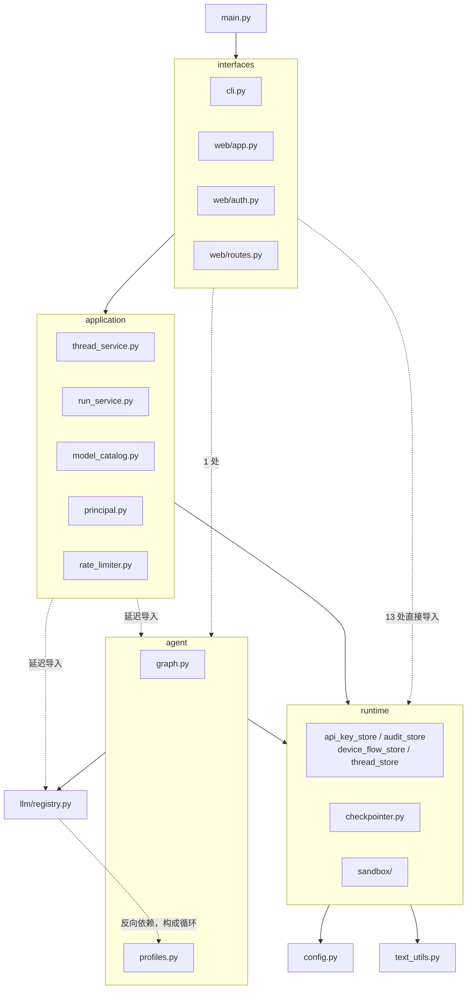
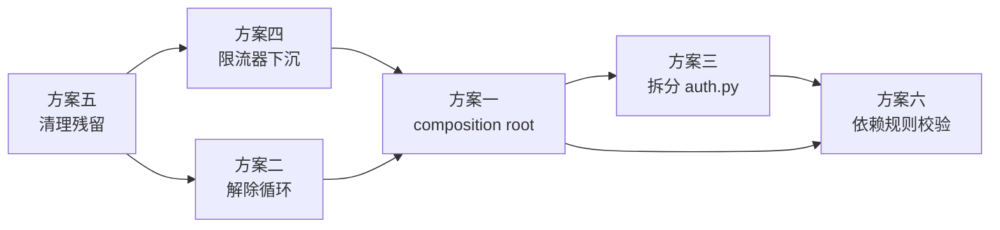
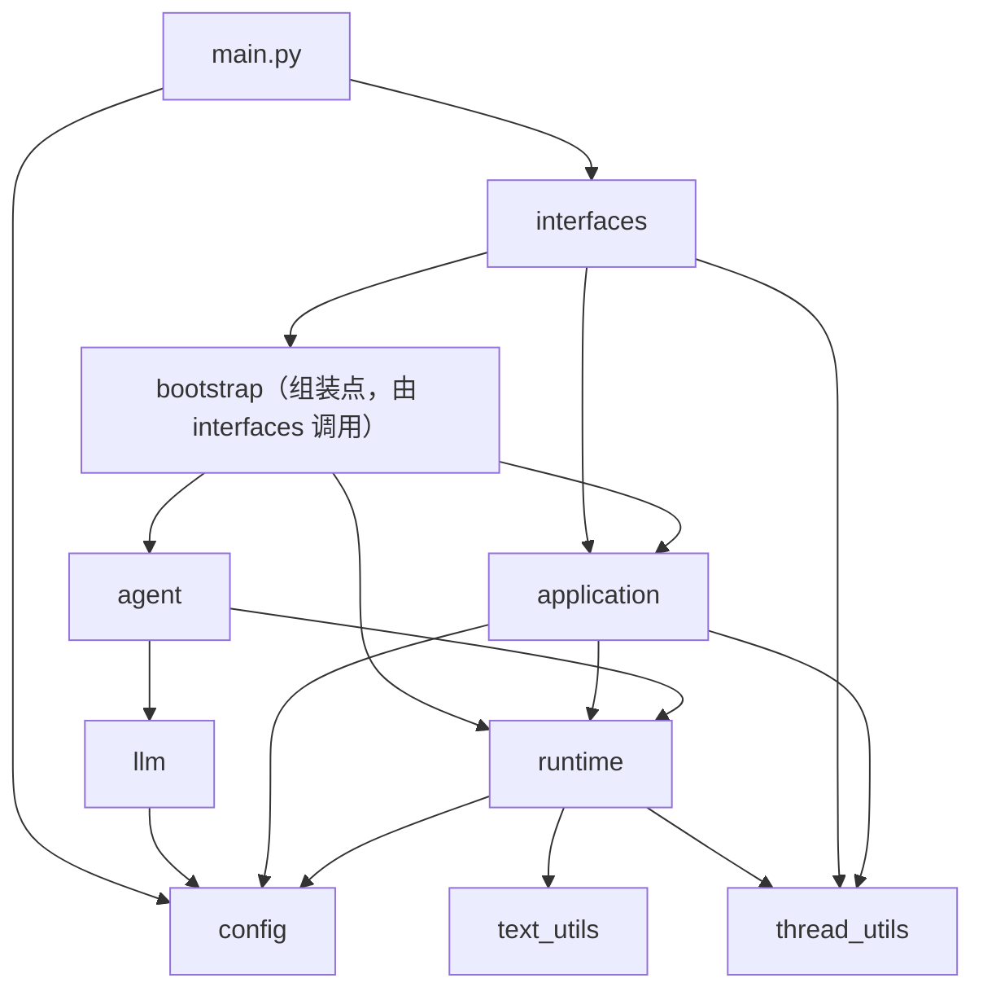

# MyAgentHarness 分层架构评估与重构方案

> 版本：v1.0
> 日期：2026-09-16
> 评估范围：全项目 Python 源码的目录组织、模块边界与跨层依赖
> 配套文档：`认证与鉴权技术方案.md`、`认证与鉴权体系.md`、`功能完整度分析与缺失功能清单.md`

---

## 目录

1. [文档目的与适用范围](#1-文档目的与适用范围)
2. [评估结论摘要](#2-评估结论摘要)
3. [现状分析](#3-现状分析)
4. [问题清单](#4-问题清单)
5. [对质量属性的影响](#5-对质量属性的影响)
6. [重构方案](#6-重构方案)
7. [实施计划](#7-实施计划)
8. [验收标准](#8-验收标准)
9. [风险与缓解](#9-风险与缓解)
10. [附录](#10-附录)

---

## 1. 文档目的与适用范围

### 1.1 目的

本文档回答三个问题：

1. 当前项目的目录与模块组织，是否满足「关注点分离、职责单一、依赖方向明确」这三项基本架构原则？
2. 若存在问题，具体是哪些问题，分别由哪几行代码承担举证？
3. 如何在不破坏现有可用性的前提下，分阶段、可验收地完成修正？

### 1.2 适用范围

**覆盖**：

- 项目根目录下 `agent/`、`application/`、`interfaces/`、`llm/`、`runtime/`、`scripts/` 六个包的模块依赖关系
- 根级模块 `config.py`、`main.py`、`text_utils.py` 的归属
- 跨层导入、循环依赖、装配职责分布

**不覆盖**：

- `runtime/sandbox/` 内部的沙箱实现细节（该子包内部组织合理，不在本次议题内）
- 前端静态资源（`interfaces/web/static/`）的结构
- 业务逻辑正确性、算法实现质量
- 数据库 schema 设计
- 认证鉴权的协议实现细节（见 `认证与鉴权技术方案.md`）

### 1.3 评估依据

| 原则 | 判定标准 |
| --- | --- |
| **关注点分离** | 每一层只处理一类关注点，不把协议适配、业务编排、基础设施实现混在同一模块 |
| **职责单一** | 单个模块的变更理由应当唯一；单文件超过 500 行需给出理由 |
| **依赖方向明确** | 依赖必须单向收敛，不存在包级循环；上层可依赖下层，下层不得反向依赖上层 |
| **层间不可跨越** | 接口层不得绕过应用层直接依赖基础设施层 |

---

## 2. 评估结论摘要

**总体判断**：项目的**层内组织是良好的**，问题集中在**层间边界**。

- 分层设计、包命名、职责声明（各 `__init__.py` 的 docstring）都有明确意图
- 三处关键的架构权衡（`text_utils.py` 下沉、`agent/graph.py` 单点装配、`AgentFactory` 实例持有缓存）都有充分论证
- 但存在 **1 处包级循环依赖** 和 **13 处跨层直接导入**，以及 **2 套重复的装配逻辑**

问题清单汇总：

| 编号 | 问题 | 级别 | 证据数量 |
| --- | --- | --- | --- |
| P1 | `interfaces` 层跨层直接依赖 `runtime` 层 | **P0** | 13 处导入 |
| P2 | `agent` ↔ `llm` 包级循环依赖 | **P0** | 2 处导入 |
| P3 | 装配逻辑重复且分散在两个入口 | **P0** | 2 套装配 |
| P4 | `interfaces/web/app.py` 越过应用层依赖 `agent` | P1 | 1 处导入 |
| P5 | `interfaces/web/auth.py` 职责过载（36KB 单文件） | P1 | 6 类关注点 |
| P6 | `application/rate_limiter.py` 归属错误 | P2 | 1 个模块 |
| P7 | `tool/` 空目录与 `test.txt` 残留 | P2 | 2 项 |

---

## 3. 现状分析

### 3.1 目录结构

```text
MyAgentHarness/
├── main.py                    # 入口分发（CLI / Web）
├── config.py                  # 全局配置中心
├── text_utils.py              # 中立文本工具（与 config 同级）
├── test.txt                   # ⚠ 残留文件
├── agent/                     # Agent 装配层
│   ├── backends.py            # Backend 构造（按执行档位）
│   ├── graph.py               # create_deep_agent 唯一调用点
│   ├── guardrails.py          # 权限与中断策略
│   ├── profiles.py            # HarnessProfile 注册
│   └── sandbox_backend.py     # 沙箱文件系统 Backend
├── application/               # 应用服务层
│   ├── dto.py                 # 对外数据结构
│   ├── errors.py              # 应用异常
│   ├── events.py              # 事件协议
│   ├── event_translator.py    # LangGraph 事件 → 对外事件
│   ├── interrupt_codec.py     # 中断载荷编解码
│   ├── model_catalog.py       # 模型只读目录
│   ├── principal.py           # 认证主体与 RBAC 模型
│   ├── rate_limiter.py        # ⚠ 基础设施组件放在应用层
│   ├── runnable.py            # 运行配置构造
│   ├── run_service.py         # 运行推进
│   └── thread_service.py      # 会话元数据生命周期
├── interfaces/                # 接口适配层
│   ├── cli.py                 # CLI 适配器（含装配）
│   └── web/
│       ├── app.py             # FastAPI 应用工厂（含装配）
│       ├── auth.py            # ⚠ 36KB，6 类关注点混合
│       ├── routes.py          # REST 路由
│       ├── schemas.py         # 请求/响应模型
│       ├── sse.py             # SSE 编码
│       └── static/            # 前端资源
├── llm/                       # 模型注册
│   └── registry.py            # ⚠ 反向依赖 agent.profiles
├── runtime/                   # 基础设施层
│   ├── api_key_store.py
│   ├── audit_store.py
│   ├── checkpointer.py
│   ├── device_flow_store.py
│   ├── store.py
│   ├── thread_store.py
│   └── sandbox/               # 沙箱子包（内部组织合理）
├── scripts/                   # 运维脚本
├── tool/                      # ⚠ 空目录
└── workspace/
```

### 3.2 实际依赖关系

下图是从源码 `import` 语句实测得出的依赖图，虚线表示违反分层约定的依赖：



依赖矩阵（行依赖列）：

| ↓依赖者 \ 被依赖→ | config | text_utils | agent | llm | application | runtime | interfaces |
| --- | --- | --- | --- | --- | --- | --- | --- |
| **interfaces** | ✅ | — | ⚠️ | — | ✅ | ⚠️ | ✅ |
| **application** | ✅ | ✅ | ⚠️(延迟) | ⚠️(延迟) | ✅ | ✅ | ❌ |
| **agent** | ✅ | — | ✅ | ✅ | ❌ | ✅ | ❌ |
| **llm** | ✅ | — | ⚠️ | ✅ | ❌ | ❌ | ❌ |
| **runtime** | ✅ | ✅ | ❌ | ❌ | ❌ | ✅ | ❌ |

说明：

- `⚠️` 表示违反预期的依赖方向
- `application → agent` 与 `application → llm` 均为 `TYPE_CHECKING` 或函数内延迟导入，未在模块加载期构成循环，但方向仍不理想
- `runtime → text_utils` 是刻意为之，`text_utils.py` 的模块 docstring 已说明理由（避免 `application ↔ runtime` 循环），属于**正确的权衡**

### 3.3 各层职责声明

项目在 `__init__.py` 中对层职责有明确声明，这部分做得很好：

```1:8:application/__init__.py
"""应用层：把 LangGraph 的内部事件翻译成稳定的对外协议。

对外提供三件事，彼此职责互不重叠：

- :class:`ThreadService` 会话的元数据生命周期（清单、历史、删除）
- :class:`RunService`   一次运行的推进与事件产出
- :class:`ModelCatalog` 可切换模型的只读目录
"""
```

```1:1:runtime/__init__.py
"""运行时层：检查点持久化、长期存储与会话元数据。"""
```

```1:5:interfaces/cli.py
"""命令行交互适配器。

职责边界：只负责「把事件画出来」和「向用户要决策」，不持有任何 Agent 逻辑。
与 Web 端唯一的区别就是决策来源这里是 stdin。
"""
```

**关键矛盾**：`interfaces/cli.py` 声明自己"只负责把事件画出来"，但该文件实际同时承担了对象装配（打开 4 个 `runtime` store）。声明与实现不一致，正是问题的根源。

---

## 4. 问题清单

### P1：`interfaces` 层跨层直接依赖 `runtime` 层

**现象**：接口层绕过应用层，直接导入基础设施层的工厂函数与类型。

**证据（共 13 处）**：

```22:26:interfaces/web/app.py
from runtime.api_key_store import open_api_key_store
from runtime.audit_store import open_audit_store
from runtime.checkpointer import checkpointer_context
from runtime.device_flow_store import open_device_flow_store
from runtime.thread_store import open_thread_store
```

```27:29:interfaces/web/auth.py
from runtime.api_key_store import APIKeyStore
from runtime.audit_store import AuditStore
from runtime.device_flow_store import DeviceFlowStore
```

```27:30:interfaces/cli.py
from runtime.api_key_store import open_api_key_store
from runtime.audit_store import open_audit_store
from runtime.checkpointer import checkpointer_context
from runtime.thread_store import open_thread_store
```

```40:40:interfaces/web/routes.py
from runtime.thread_store import normalize_thread_id
```

**根因**：项目缺少独立的组装层（composition root）。`interfaces/cli.py` 的 `run_cli` 与 `interfaces/web/app.py` 的 `_lifespan` 各自承担了对象组装职责，而组装必须访问 `runtime`，于是产生了跨层导入。

**影响**：

- 接口层同时具备"协议适配"与"对象组装"两重身份，违反职责单一
- 更换基础设施实现（如 SQLite → PostgreSQL）需要修改接口层
- 接口层无法在没有真实数据库的情况下被独立测试

---

### P2：`agent` ↔ `llm` 包级循环依赖

**现象**：两个包互相导入，形成闭环。

**证据**：

```24:24:llm/registry.py
from agent.profiles import ensure_profiles_registered
```

```26:26:agent/graph.py
from llm.registry import ModelRegistry, build_default_registry
```

`llm/registry.py` 在 `_build` 方法中调用该函数：

```168:170:llm/registry.py
    def _build(self, spec: ModelSpec) -> BaseChatModel:
        """真正构造模型实例，异常统一收敛为 RuntimeError。"""
        ensure_profiles_registered()
```

**根因**：`ensure_profiles_registered()` 的调用点被放在 `llm` 包内部。但从职责上讲，"注册 HarnessProfile"是 `agent` 装配阶段的动作，`llm` 只应负责"按名字提供模型实例"。

**运行时是否崩溃**：不会。因为 `agent/profiles.py` 只依赖 `deepagents`，不会反向导入 `llm`，Python 的模块缓存可以化解。但这属于**靠巧合维持**，而不是靠设计保证。

**影响**：

- 两个包无法独立安装、独立测试
- 导入顺序成为隐式契约，任何人重构 `profiles.py` 时可能意外引入真实循环
- 静态分析工具（如 import-linter）无法通过

---

### P3：装配逻辑重复且分散在两个入口

**现象**：同一套对象组装在两个地方各写一遍。

**证据 —— Web 端装配**：

```52:82:interfaces/web/app.py
    async with (
        checkpointer_context(config.db_path) as checkpointer,
        open_thread_store(config.db_path) as thread_store,
        open_audit_store(config.db_path) as audit_store,
        open_api_key_store(config.db_path) as api_key_store,
        open_device_flow_store(config.db_path) as device_flow_store,
    ):
        graph_factory = AgentFactory(config, checkpointer=checkpointer)
        ...
        app.state.threads = ThreadService(
            config,
            checkpointer=checkpointer,
            thread_store=thread_store,
            graph_factory=graph_factory,
            audit_store=audit_store,
        )
        app.state.runs = RunService(
            config,
            thread_store=thread_store,
            graph_factory=graph_factory,
            audit_store=audit_store,
        )
        app.state.catalog = ModelCatalog(get_registry(config))
```

**证据 —— CLI 端装配**：

```338:341:interfaces/cli.py
        checkpointer_context(config.db_path) as checkpointer,
        open_thread_store(config.db_path) as thread_store,
        open_audit_store(config.db_path) as audit_store,
        open_api_key_store(config.db_path) as api_key_store,
```

**根因**：与 P1 同源。缺少统一组装层，导致每个入口自行组装。

**影响**：

- 任一依赖的构造方式变更（如新增一个 store 参数），必须同步修改两处
- 两处装配可能产生行为分叉，例如 Web 端注入了 `audit_store` 而 CLI 端遗漏，会造成"Web 有审计、CLI 无审计"的安全盲区
- 新增第三种形态（如 MCP Server、消息队列消费者）时必须再复制一遍

---

### P4：`interfaces/web/app.py` 越过应用层依赖 `agent`

**现象**：接口层直接依赖装配层，跳过应用层。

**证据**：

```15:15:interfaces/web/app.py
from agent.graph import AgentFactory, get_registry
```

**根因**：`app.py` 需要构造 `AgentFactory` 与 `ModelCatalog`，而这两者的装配知识属于 `agent` 层。

**影响**：接口层与应用层之间的边界被绕过，`agent` 的装配接口变更会直接波及 `interfaces`。

---

### P5：`interfaces/web/auth.py` 职责过载

**现象**：单文件 36KB，约 1100 行，混合六类互不相关的关注点。

**证据（按功能分段的实际行号）**：

| 关注点 | 行号区间 | 说明 |
| --- | --- | --- |
| 会话 Cookie 签名与读写 | 74–170 | `_session_serializer`、`get_session`、`set_session_cookie` |
| Principal 提取与权限依赖 | 210–350 | `get_principal`、`_validate_api_key`、`require_permission` |
| OIDC 完整流程 | 353–700 | Discovery、PKCE、JWKS、`_verify_id_token`、`login`、`callback`、`logout` |
| API Key 管理端点 | 730–797 | 创建、列出、吊销 |
| 审计日志端点 | 799–819 | 查询审计 |
| Device Flow | 821–1097 | 授权、激活页、轮询 token、HTML 渲染 |

**根因**：模块按"认证相关"这一宽泛主题聚合，而非按变更理由聚合。

**影响**：

- 改 Device Flow 的 HTML 渲染需要在一个含 OIDC 密码学校验的文件中定位
- 单元测试需要同时准备 HTTP 上下文、OIDC mock、数据库 store
- 代码评审时，OIDC 相关的安全改动会淹没在大量无关 diff 中

---

### P6：`application/rate_limiter.py` 归属错误

**现象**：一个纯基础设施组件被放在应用层。

**证据**：

```13:21:application/rate_limiter.py
from __future__ import annotations

import logging
import threading
import time
from collections import defaultdict
from dataclasses import dataclass, field

logger = logging.getLogger(__name__)
```

该模块只使用 `threading` 与 `time`，不含任何业务语义，也不依赖 `application` 层其他模块。其使用者是 `interfaces/web/auth.py` 与 `interfaces/web/app.py`。

**根因**：随认证功能一起新增时，按"功能归属"而非"技术职责"归类。

**影响**：

- 语义错位：接口层为拿一个基础设施组件，不得不依赖应用层
- 若未来 `runtime` 层也需要限流（如限制 store 访问频率），会形成 `runtime → application` 反向依赖

---

### P7：目录与文件残留

**现象**：

- `tool/` 是空目录
- 根目录存在 `test.txt`

**影响**：轻微。但空目录会被打包工具、静态检查工具误判为有效包；`test.txt` 会污染仓库根目录语义。

---

## 5. 对质量属性的影响

| 质量属性 | 受影响的问题 | 具体表现 |
| --- | --- | --- |
| **可维护性** | P1、P3 | 装配逻辑两处重复；改一处漏一处；`auth.py` 36KB 定位困难 |
| **可测试性** | P1、P2、P5 | 测试应用服务需绕过接口层装配；`agent`/`llm` 无法隔离测试；`auth.py` 难写单元测试 |
| **可扩展性** | P1、P3、P4 | 新增接口形态需复制装配；更换存储实现需改接口层 |
| **一致性/安全性** | P3 | Web 与 CLI 装配分叉可能导致鉴权行为不一致，属安全相关隐性风险 |
| **可静态验证性** | P1、P2 | 无法用 import-linter 等工具强制约束层间依赖 |

---

## 6. 重构方案

### 方案一：引入独立的 composition root

#### 目标

将所有对象组装职责从 `interfaces` 层剥离，收敛到唯一的顶层组装层，使 `interfaces` 只接收已组装好的依赖。

#### 适用范围

- `interfaces/web/app.py` 的 `_lifespan`
- `interfaces/cli.py` 的 `run_cli`
- 不涉及 `application`、`agent`、`runtime` 内部实现

#### 实施步骤

**步骤 1**：新建 `bootstrap/` 包

```text
bootstrap/
├── __init__.py
├── context.py       # AppContext：跨形态共享的已装配依赖集合
├── core.py          # 组装核心依赖（store / graph_factory / services）
└── web.py           # 组装 Web 专有依赖（http_client / rate_limiter）
```

**步骤 2**：定义 `AppContext`

```python
# bootstrap/context.py
"""应用级已装配依赖集合。"""

from __future__ import annotations

from dataclasses import dataclass
from typing import TYPE_CHECKING

if TYPE_CHECKING:
    from langgraph.checkpoint.base import BaseCheckpointSaver

    from agent.graph import AgentFactory
    from application.model_catalog import ModelCatalog
    from application.run_service import RunService
    from application.thread_service import ThreadService
    from config import AppConfig
    from runtime.api_key_store import APIKeyStore
    from runtime.audit_store import AuditStore
    from runtime.device_flow_store import DeviceFlowStore
    from runtime.thread_store import ThreadMetaStore


@dataclass(frozen=True)
class AppContext:
    """装配完成的依赖集合。

    WHY 不可变：装配阶段结束后不应再被替换，避免运行期出现
    「半新半旧」的依赖组合，这类问题只在并发路径下暴露，极难复现。
    """

    config: AppConfig
    checkpointer: BaseCheckpointSaver
    thread_store: ThreadMetaStore
    audit_store: AuditStore
    api_key_store: APIKeyStore
    device_flow_store: DeviceFlowStore
    graph_factory: AgentFactory
    threads: ThreadService
    runs: RunService
    catalog: ModelCatalog
```

**步骤 3**：`bootstrap/core.py` 提供异步上下文管理器

```python
# bootstrap/core.py
"""核心依赖组装：CLI 与 Web 共用。"""

from __future__ import annotations

import logging
from collections.abc import AsyncIterator
from contextlib import asynccontextmanager

from agent.graph import AgentFactory, get_registry
from application.model_catalog import ModelCatalog
from application.run_service import RunService
from application.thread_service import ThreadService
from bootstrap.context import AppContext
from config import AppConfig
from runtime.api_key_store import open_api_key_store
from runtime.audit_store import open_audit_store
from runtime.checkpointer import checkpointer_context
from runtime.device_flow_store import open_device_flow_store
from runtime.thread_store import open_thread_store

logger = logging.getLogger(__name__)


@asynccontextmanager
async def build_app_context(config: AppConfig) -> AsyncIterator[AppContext]:
    """组装跨形态共享的核心依赖。

    WHY 用上下文管理器：store 与 checkpointer 的生命周期必须与进程一致，
    只有交给 ``async with`` 才能保证异常退出时也被关闭。
    """
    if config is None:
        raise ValueError("config 不能为 None")

    async with (
        checkpointer_context(config.db_path) as checkpointer,
        open_thread_store(config.db_path) as thread_store,
        open_audit_store(config.db_path) as audit_store,
        open_api_key_store(config.db_path) as api_key_store,
        open_device_flow_store(config.db_path) as device_flow_store,
    ):
        graph_factory = AgentFactory(config, checkpointer=checkpointer)
        context = AppContext(
            config=config,
            checkpointer=checkpointer,
            thread_store=thread_store,
            audit_store=audit_store,
            api_key_store=api_key_store,
            device_flow_store=device_flow_store,
            graph_factory=graph_factory,
            threads=ThreadService(
                config,
                checkpointer=checkpointer,
                thread_store=thread_store,
                graph_factory=graph_factory,
                audit_store=audit_store,
            ),
            runs=RunService(
                config,
                thread_store=thread_store,
                graph_factory=graph_factory,
                audit_store=audit_store,
            ),
            catalog=ModelCatalog(get_registry(config)),
        )
        logger.info("核心依赖装配完成：db=%s", config.db_path)
        yield context
        logger.info("核心依赖已释放")
```

**步骤 4**：`interfaces/web/app.py` 改为只接收 `AppContext`

```python
def create_app(context: AppContext) -> FastAPI:
    """构造 FastAPI 应用。

    Args:
        context: 已装配完成的依赖集合，由 bootstrap 层提供。

    Returns:
        已装配路由与静态资源的应用实例。
    """
    if context is None:
        raise ValueError("context 不能为 None")

    app = FastAPI(title="通用 Agent", lifespan=_lifespan)
    app.state.context = context
    app.state.config = context.config
    app.include_router(auth_router)
    app.include_router(router)
    ...
```

`_lifespan` 内不再出现任何 `open_*_store` 调用，仅管理 Web 专有的 `http_client` 与 `rate_limiter`。

**步骤 5**：`main.py` 成为真正的组装入口

```python
def _run_web(config: AppConfig, host: str | None, port: int | None) -> int:
    import uvicorn

    from bootstrap.core import build_app_context
    from interfaces.web.app import create_app

    async def _serve() -> None:
        async with build_app_context(config) as context:
            app = create_app(context)
            server = uvicorn.Server(
                uvicorn.Config(
                    app,
                    host=host or config.host,
                    port=port or config.port,
                    log_level=config.log_level.lower(),
                )
            )
            await server.serve()

    try:
        asyncio.run(_serve())
    except KeyboardInterrupt:
        print("\n服务已停止", file=sys.stderr)
    return 0
```

#### 预期效果

| 指标 | 当前 | 重构后 |
| --- | --- | --- |
| `interfaces` 层直接导入 `runtime` 的处数 | 13 | 0 |
| 装配逻辑份数 | 2（Web + CLI） | 1（`bootstrap/core.py`） |
| `interfaces/web/app.py` 职责 | 协议适配 + 对象组装 | 仅协议适配 |
| 新增接口形态的装配成本 | 复制约 60 行装配代码 | 复用 `build_app_context` |
| `interfaces` 可独立测试性 | 需真实 SQLite | 可注入 mock `AppContext` |

#### 风险

`main.py` 从同步入口改为 `asyncio.run` 包裹，需确认 uvicorn 的 `Server.serve()` 与现有 `uvicorn.run()` 在信号处理上的行为一致。建议保留 `uvicorn.run()` 的调用方式，改为在 `lifespan` 中通过 `bootstrap` 组装，以避免行为差异。

#### 验收标准

1. `interfaces/` 目录下不存在任何 `from runtime` 或 `import runtime` 语句
2. `interfaces/web/app.py` 与 `interfaces/cli.py` 中不存在 `open_*_store` 调用
3. Web 与 CLI 两种形态功能回归通过

---

### 方案二：解除 `agent` ↔ `llm` 循环依赖

#### 目标

使 `llm` 包只依赖 `config`，消除与 `agent` 的双向依赖，让依赖方向恢复为单向 `agent → llm`。

#### 适用范围

- `llm/registry.py` 的模块级导入与 `_build` 方法
- `agent/graph.py` 的 `get_registry`
- 不涉及 `agent/profiles.py` 内部实现

#### 实施步骤

**步骤 1**：确认调用覆盖

当前 `ensure_profiles_registered()` 有两个调用点：

- `llm/registry.py:170`（`_build` 内）
- `agent/graph.py:55`（`get_registry` 内）

而 `agent/graph.py:84` 的 `build_agent` 也是通过 `get_registry(config)` 取得 registry，因此**所有模型构造路径都先经过 `agent/graph.py:55`**，该调用已覆盖 `llm` 侧的需求。

**步骤 2**：移除 `llm/registry.py` 中的反向依赖

删除模块级导入：

```python
# 删除这一行
from agent.profiles import ensure_profiles_registered
```

删除 `_build` 中的调用：

```python
    def _build(self, spec: ModelSpec) -> BaseChatModel:
        """真正构造模型实例，异常统一收敛为 RuntimeError。

        WHY 不再在此注册 HarnessProfile：注册属于装配层职责，
        由 agent.graph.get_registry 在构造 registry 前完成，
        避免 llm 包反向依赖 agent 形成循环。
        """
        api_key = os.getenv(spec.api_key_env, "").strip() if spec.api_key_env else ""
```

**步骤 3**：在 `bootstrap/core.py` 中显式调用，作为唯一的装配保证

```python
from agent.profiles import ensure_profiles_registered

@asynccontextmanager
async def build_app_context(config: AppConfig) -> AsyncIterator[AppContext]:
    ensure_profiles_registered()
    ...
```

**步骤 4**：在 `llm/registry.py` 增加前置条件说明

```python
def build_default_registry(config: AppConfig) -> ModelRegistry:
    """从配置构造注册表。

    前置条件：调用方必须已注册 HarnessProfile（见 ``agent.profiles``），
    通常由装配层或 ``agent.graph.get_registry`` 完成。本模块刻意不自行注册，
    以避免反向依赖 ``agent`` 包。
    """
```

#### 预期效果

| 指标 | 当前 | 重构后 |
| --- | --- | --- |
| 包级循环依赖数量 | 1 | 0 |
| `llm` 包的外部依赖 | `agent.profiles` + `config` | 仅 `config` |
| `llm` 可独立测试性 | 需先导入 `agent` | 可直接导入 |
| import-linter 规则可执行性 | 无法通过 | 可通过 |

#### 风险

若未来存在绕过 `get_registry` 直接调用 `build_default_registry` 的路径，Profile 将不会被注册。缓解方式：在 `bootstrap` 层显式调用一次，并在 `build_default_registry` 的 docstring 中标注前置条件。

#### 验收标准

1. `llm/` 目录下不存在任何 `from agent` 或 `import agent` 语句
2. `python -c "import llm.registry"` 可在不预先导入 `agent` 的情况下成功
3. Agent 装配与模型切换功能回归通过

---

### 方案三：拆分 `interfaces/web/auth.py`

#### 目标

将 36KB 单文件按变更理由拆分为多个内聚模块，使每个模块的职责唯一。

#### 适用范围

- `interfaces/web/auth.py` 拆分为 `interfaces/web/auth/` 子包
- 不改变对外契约：`router`、`get_principal`、`require_permission` 的导入路径保持不变

#### 实施步骤

**步骤 1**：建立子包结构

```text
interfaces/web/auth/
├── __init__.py       # 汇总导出，保持既有导入路径不变
├── session.py        # 会话 Cookie 签名、读写、清理
├── oidc.py           # Discovery、PKCE、JWKS、token 交换、id_token 校验
├── apikey.py         # API Key 校验与管理工作
├── device_flow.py    # CLI 设备授权流程与激活页
├── audit.py          # 审计辅助函数
├── deps.py           # get_principal / require_permission
└── views.py          # device flow 激活页 HTML 渲染
```

**步骤 2**：`__init__.py` 保持向后兼容

```python
# interfaces/web/auth/__init__.py
"""Web 端认证与授权子包。

对外只暴露与原 ``auth.py`` 相同的符号，调用方导入路径无需修改。
"""

from interfaces.web.auth.deps import get_principal, require_permission
from interfaces.web.auth.router import router

__all__ = ["get_principal", "require_permission", "router"]
```

**步骤 3**：各模块职责划分

| 模块 | 从原文件迁移的内容 | 预计行数 |
| --- | --- | --- |
| `session.py` | `_session_serializer`、`get_session`、`set_session_cookie`、`clear_session_cookie`、`_set/_get/_clear_ephemeral_cookie` | 约 110 |
| `audit.py` | `_audit_auth`、`_client_ip`、`_user_agent` | 约 60 |
| `oidc.py` | `_discovery_url`、`_get_oidc_discovery`、`_get_jwks`、`_verify_id_token`、`_exchange_code` | 约 200 |
| `apikey.py` | `_validate_api_key`、`_get_bearer_token`、`create/list/revoke_api_key` | 约 130 |
| `device_flow.py` | `device_authorize`、`device_activate_page`、`device_activate`、`device_token` | 约 220 |
| `views.py` | `_render_activate_html` | 约 60 |
| `deps.py` | `get_principal`、`require_permission`、`_principal_from_session`、`_check_rate_limit` | 约 120 |
| `router.py` | 组装各子路由（`login`、`callback`、`logout`、`me`、`config`） | 约 180 |

**步骤 4**：子路由合并策略

FastAPI 的 `APIRouter` 支持嵌套。各功能模块各自定义子 router，最后在 `router.py` 汇总：

```python
# interfaces/web/auth/router.py
from fastapi import APIRouter

from interfaces.web.auth.apikey import router as apikey_router
from interfaces.web.auth.device_flow import router as device_flow_router
from interfaces.web.auth.flow import router as flow_router

router = APIRouter(prefix="/auth", tags=["auth"])
router.include_router(flow_router)
router.include_router(apikey_router)
router.include_router(device_flow_router)
```

#### 预期效果

| 指标 | 当前 | 重构后 |
| --- | --- | --- |
| `auth.py` 单文件行数 | 约 1100 | 拆分为 8 个模块 |
| 单模块最大行数 | 1100 | 约 220（`device_flow.py`） |
| 单元测试所需上下文 | HTTP + OIDC mock + DB store | 按模块最小化 |
| 修改 Device Flow 影响的文件 | 整个 auth.py | 仅 `device_flow.py` + `views.py` |

#### 风险

拆分过程中容易出现循环导入（如 `deps.py` 需要 `session.py`，`apikey.py` 需要 `audit.py`）。需先画出依赖顺序：`views` → `session` → `deps` → `{oidc, apikey, device_flow}` → `router`，自下而上实现。

#### 验收标准

1. `interfaces/web/auth/` 下不存在单文件超过 300 行
2. 原有导入路径 `from interfaces.web.auth import get_principal` 仍然有效
3. 登录、登出、API Key 管理、Device Flow 四项功能回归通过

---

### 方案四：`rate_limiter` 下沉至 `runtime`

#### 目标

使基础设施组件回到基础设施层，消除接口层为获取该组件而对应用层的依赖。

#### 适用范围

- `application/rate_limiter.py` → `runtime/rate_limiter.py`
- 更新 `interfaces/web/auth.py`、`interfaces/web/app.py` 的导入路径
- 不改变 `RateLimiter` 类的实现

#### 实施步骤

**步骤 1**：迁移文件

将 `application/rate_limiter.py` 移动至 `runtime/rate_limiter.py`，类定义与实现完全不变。

**步骤 2**：更新导入

```python
# interfaces/web/auth.py
from runtime.rate_limiter import RateLimiter
```

```python
# interfaces/web/app.py
from runtime.rate_limiter import RateLimiter
```

**步骤 3**：更新 `runtime/__init__.py` 导出

```python
# runtime/__init__.py
"""运行时层：检查点持久化、长期存储、会话元数据与限流。"""

from runtime.checkpointer import checkpointer_context
from runtime.rate_limiter import RateLimiter
from runtime.store import build_store
from runtime.thread_store import ThreadMetaStore, open_thread_store

__all__ = [
    "RateLimiter",
    "ThreadMetaStore",
    "build_store",
    "checkpointer_context",
    "open_thread_store",
]
```

#### 预期效果

| 指标 | 当前 | 重构后 |
| --- | --- | --- |
| `application` 层含基础设施组件的数量 | 1 | 0 |
| 限流器的依赖方向 | interfaces → application | interfaces → runtime |
| `runtime` 内部复用限流的可行性 | 会形成反向依赖，不可行 | 可直接复用 |

#### 风险

无实质风险。该模块不依赖 `application` 层任何内容，迁移是纯位置变更。

#### 验收标准

1. `application/` 目录下不存在 `rate_limiter.py`
2. 认证端点限流功能回归通过

---

### 方案五：清理残留

#### 目标

移除不再使用的目录与文件，保持仓库语义清晰。

#### 适用范围

- `tool/` 空目录
- 根目录 `test.txt`

#### 实施步骤

1. 确认 `tool/` 无任何引用：检索全项目 `from tool` 与 `import tool`
2. 删除 `tool/` 目录
3. 确认 `test.txt` 无引用后删除

#### 预期效果

消除空包与游离文件对静态检查工具的干扰。

#### 风险

若 `tool/` 是预留的未来扩展点，应通过 `README` 或占位说明保留意图，而不是保留空目录。

#### 验收标准

项目根目录不再存在 `tool/` 与 `test.txt`。

---

### 方案六：建立层间依赖规则与自动校验

#### 目标

把架构约定从"文档里的共识"变成"CI 能拦截的规则"，防止重构后随时间退化。

#### 适用范围

- 项目根目录新增 `importlinter` 配置
- CI 流程或本地 pre-commit 钩子

#### 实施步骤

**步骤 1**：在 `pyproject.toml` 中声明依赖

```toml
[dependency-groups]
dev = [
    "import-linter>=2.0",
]
```

**步骤 2**：新增 `.importlinter` 配置

```ini
[importlinter]
root_package = .

[importlinter:contract:layered-architecture]
name = 分层架构：interfaces → application → runtime
type = layers
layers =
    interfaces
    application
    agent
    llm
    runtime
    config

[importlinter:contract:no-cycles]
name = 不存在包级循环依赖
type = forbidden
source_modules =
    agent
    llm
forbidden_modules =
    agent

[importlinter:contract:interfaces-isolation]
name = interfaces 不得直接依赖 runtime
type = forbidden
source_modules =
    interfaces
forbidden_modules =
    runtime
```

**步骤 3**：加入校验命令

```bash
uv run lint-imports
```

建议纳入提交前检查与 CI 流程。

#### 预期效果

| 指标 | 当前 | 重构后 |
| --- | --- | --- |
| 架构规则的可执行性 | 仅靠人工评审 | CI 自动拦截 |
| 规则退化的发现时机 | 问题累积后 | 提交时立即发现 |

#### 风险

`.importlinter` 的规则需与方案一至四完成后的实际结构一致，否则会误报。建议在方案一至四完成后启用。

#### 验收标准

1. `uv run lint-imports` 通过
2. 故意在 `interfaces` 中新增 `from runtime import ...` 时，该命令能报错

---

## 7. 实施计划

### 7.1 阶段划分

| 阶段 | 内容 | 前置依赖 | 风险等级 |
| --- | --- | --- | --- |
| **阶段一** | 方案五（清理残留） | 无 | 极低 |
| **阶段一** | 方案二（解除循环依赖） | 无 | 低 |
| **阶段一** | 方案四（限流器下沉） | 无 | 低 |
| **阶段二** | 方案一（composition root） | 阶段一完成 | 中 |
| **阶段三** | 方案三（拆分 auth.py） | 阶段二完成 | 中 |
| **阶段四** | 方案六（依赖规则校验） | 阶段一至三完成 | 低 |

### 7.2 依赖关系



方案一必须在方案三之前完成：拆分 `auth.py` 时，子模块的依赖注入方式应基于 `AppContext`，否则拆分后仍需返工。

方案六必须最后执行：校验规则需要匹配重构后的真实结构。

### 7.3 每阶段的交付物

| 阶段 | 交付物 | 验证方式 |
| --- | --- | --- |
| 阶段一 | 依赖图无循环；`application` 无基础设施组件 | 手动导入测试 + 功能回归 |
| 阶段二 | `bootstrap/` 包；`interfaces` 无 `runtime` 导入 | 全量功能回归（Web + CLI） |
| 阶段三 | `interfaces/web/auth/` 子包 | 认证四项功能回归 |
| 阶段四 | `.importlinter` 配置 | `lint-imports` 通过 |

---

## 8. 验收标准

### 8.1 架构约束（可自动校验）

| 编号 | 约束 | 校验方式 |
| --- | --- | --- |
| A1 | `interfaces` 不导入 `runtime` | import-linter 规则 |
| A2 | `llm` 不导入 `agent` | import-linter 规则 |
| A3 | `runtime` 不导入 `application` / `interfaces` | import-linter 规则 |
| A4 | `application` 不导入 `interfaces` | import-linter 规则 |
| A5 | 不存在包级循环依赖 | import-linter 规则 |

### 8.2 结构指标（可人工核查）

| 编号 | 指标 | 目标值 |
| --- | --- | --- |
| S1 | `interfaces` 直接导入 `runtime` 的处数 | 0 |
| S2 | 装配逻辑份数 | 1 |
| S3 | 包级循环依赖数量 | 0 |
| S4 | `interfaces/web/auth/` 下单文件最大行数 | ≤ 300 |
| S5 | `application/` 下基础设施组件数 | 0 |
| S6 | 空目录与游离文件数 | 0 |

### 8.3 功能回归清单

| 编号 | 场景 | 验证方式 |
| --- | --- | --- |
| F1 | Web 端 OIDC 登录 | 浏览器完整走通 |
| F2 | Web 端登出 | 登出后不自动重登 |
| F3 | API Key 创建 / 列表 / 吊销 | 接口调用验证 |
| F4 | CLI Device Flow 登录 | 终端完整走通 |
| F5 | 会话列表与历史隔离 | 多用户交叉验证 |
| F6 | 审计日志记录 | 查询验证 |
| F7 | 权限拒绝路径 | 低权限账号验证 403 |

---

## 9. 风险与缓解

| 风险 | 影响 | 概率 | 缓解措施 |
| --- | --- | --- | --- |
| 方案一改变应用启动方式导致信号处理异常 | Web 无法优雅停止 | 中 | 保留 `uvicorn.run()`，仅在 lifespan 内引入 bootstrap 组装 |
| 拆分 `auth.py` 引入循环导入 | 应用无法启动 | 中 | 严格按 `views → session → deps → 功能模块 → router` 顺序实现 |
| 装配逻辑集中后单点故障 | 一处错误影响两种形态 | 低 | 集中后测试成本反而下降，善用集成测试覆盖 |
| 重构期间功能回归遗漏 | 生产异常 | 中 | 每阶段完成后执行 F1–F7 全量回归 |
| import-linter 规则与实际结构不匹配 | 误报阻塞提交 | 中 | 方案六置于最后执行，规则按最终结构编写 |
| 并发路径下的行为差异 | 难以复现的问题 | 低 | 保持 `AppContext` 不可变；不改变任何服务内部并发实现 |

---

## 10. 附录

### 10.1 跨层导入完整清单

| 序号 | 文件 | 行号 | 导入内容 |
| --- | --- | --- | --- |
| 1 | `interfaces/web/app.py` | 15 | `agent.graph.AgentFactory`, `get_registry` |
| 2 | `interfaces/web/app.py` | 22 | `runtime.api_key_store.open_api_key_store` |
| 3 | `interfaces/web/app.py` | 23 | `runtime.audit_store.open_audit_store` |
| 4 | `interfaces/web/app.py` | 24 | `runtime.checkpointer.checkpointer_context` |
| 5 | `interfaces/web/app.py` | 25 | `runtime.device_flow_store.open_device_flow_store` |
| 6 | `interfaces/web/app.py` | 26 | `runtime.thread_store.open_thread_store` |
| 7 | `interfaces/web/auth.py` | 27 | `runtime.api_key_store.APIKeyStore` |
| 8 | `interfaces/web/auth.py` | 28 | `runtime.audit_store.AuditStore` |
| 9 | `interfaces/web/auth.py` | 29 | `runtime.device_flow_store.DeviceFlowStore` |
| 10 | `interfaces/web/routes.py` | 40 | `runtime.thread_store.normalize_thread_id` |
| 11 | `interfaces/cli.py` | 27 | `runtime.api_key_store.open_api_key_store` |
| 12 | `interfaces/cli.py` | 28 | `runtime.audit_store.open_audit_store` |
| 13 | `interfaces/cli.py` | 29 | `runtime.checkpointer.checkpointer_context` |
| 14 | `interfaces/cli.py` | 30 | `runtime.thread_store.open_thread_store` |
| 15 | `llm/registry.py` | 24 | `agent.profiles.ensure_profiles_registered` |

### 10.2 依赖方向目标态

> **2026-09-18 按实际结构同步（原图有误，对应遗留问题 L-6）**：实施时改为在
> `interfaces` 侧的 lifespan 内调用 `build_app_context`，以保持 `uvicorn.run()`
> 的启动路径零行为变更（详见《分层架构重构实施记录》KN-5）。因此依赖方向是
> **`interfaces → bootstrap`**，而不是本图原先画的 `bootstrap → interfaces`；
> `.importlinter` 契约 6 也只禁止 `application` / `agent` / `llm` / `runtime`
> 依赖 `bootstrap`，**显式允许 `interfaces` 依赖它**。
> `main.py` 不直接依赖 `bootstrap`——它只依赖 `interfaces` 与 `config`。
>
> **2026-09-18 补充（对应遗留问题 L-5 / 计划 D-7）**：`normalize_thread_id` 已从
> `runtime/thread_store.py` 下沉为根级 `thread_utils.py`，`application/thread_id.py`
> 门面随之删除。判据与当年 `text_utils.py` 相同：该规则被接口层（路径参数）、应用层
> （服务入口）与存储层（入库兜底）同时使用——放 `runtime` 会让接口层只能靠门面绕行，
> 放 `application` 则 `runtime` 反向依赖、违反契约 3。下图 `IF → THU` / `AP → THU` /
> `RT → THU` 即这三条使用路径。



### 10.3 项目已有的正确设计（重构时须保留）

以下设计在重构中必须保持不变，它们已被证明是合理的：

| 设计 | 位置 | 理由 |
| --- | --- | --- |
| `text_utils.py` 位于根目录 | 项目根 | 若放入 `application/`，`runtime/` 需反向依赖，形成循环 |
| `create_deep_agent` 单点调用 | `agent/graph.py` | 参数组合随 backend/permissions/skills 指数增长，散落会导致护栏口径不一致 |
| `AgentFactory` 实例持有缓存 | `agent/graph.py` | 缓存键必须含 checkpointer 与 store，全局缓存会导致长期记忆串味 |
| `Principal` 位于 `application/` | `application/principal.py` | 业务服务共享的概念，放入 web 层会导致反向依赖 |
| 服务通过构造函数接收 store | `application/thread_service.py` | 依赖注入明确，便于测试 |
| `runtime/sandbox/` 子包结构 | `runtime/sandbox/` | 内部依赖方向一致，protocol/factory/runner 分离清晰 |

### 10.4 参考

- 《Clean Architecture》——依赖方向原则与稳定依赖原则
- Martin Fowler, *Presentation Domain Data Layering*
- import-linter 官方文档：<https://import-linter.readthedocs.io/>

---

*本文档为架构评估与重构的设计依据，实施后的差异应同步更新至本文件或另建实施记录。*
