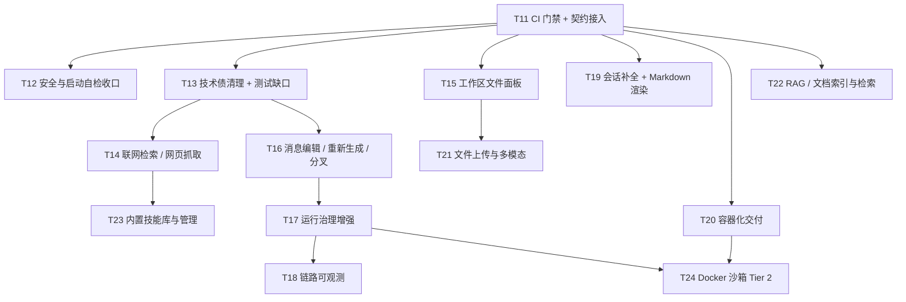

# MyAgentHarness 第三阶段开发计划

> 版本：v1.1（范围已确认 → 见 2.2）
> 制定日期：2026-09-17
> 修订记录：v1.1 —— 经确认**坚持上一阶段原承诺**，把 ⑯ 多模态、⑲ RAG、⑳ 技能库、
> ㉒ Docker 沙箱 Tier 2 由「推迟」改为本阶段交付；Sprint 由 4 个扩为 6 个（T11~T24）。
> 前置文档：《下一阶段开发计划-v2-Sprint1-4-已完结.md》（`docs/planning/archive/`）、
> 《功能完整度分析与缺失功能清单.md》、`README.md` 第九章「已知限制」
> 阶段目标：**工程门禁闭合 · 能力空白补齐 · 多人可用性收尾**
> 上一阶段（Sprint 1~4 / T1~T10）已全部交付并归档，交接基线见本文第一章。

---

## 一、交接基线（2026-09-17 实测，不引用文档结论）

### 1.1 已交付能力

| 任务 | 交付内容 | 状态 |
| --- | --- | --- |
| T1 | 认证与鉴权三模式（`disabled` / `apikey` / `oidc`）+ API Key 管理 + 会话归属 + RBAC + 认证端点限流 | ✅ |
| T2 | 运行中止：`stop` 端点 + 协作式取消 + 前端停止按钮 | ✅ |
| T3 | 审计日志：IP/UA 补齐、保留策略、JSONL 归档 sink（fail-closed） | ✅ |
| T4 | 可观测性：`/health`、`/ready`（DB + 模型静态自检）、`/metrics` | ✅ |
| T5 | 多 Provider 条件注册（DeepSeek 恒定 + OpenAI / Anthropic / Ollama 按配置） | ✅ |
| T6 | 用量统计：`usage_log` + `GET /api/usage` + 前端与 CLI 展示 | ✅ |
| T7 | 运行治理：运行超时强制取消、HITL 挂起 TTL、进程树回收（`stop` 达进程层确认） | ✅ |
| T8 | 工具扩展：配置化 MCP + 自定义工具注册器 + `GET /api/tools` + 工具调用审计 | ✅ |
| T9 | 长期记忆：SQLite Store 持久化 + 主体命名空间隔离 + `GET/DELETE /api/memories` + 记忆面板 | ✅ |
| T10 | 会话管理：重命名、标题搜索、归档（软删除可恢复）、「含已归档」开关 | ✅ |

### 1.2 交接实测数据

| 指标 | 实测值 | 取证方式 |
| --- | --- | --- |
| 测试总数 | **605 项** | `uv run pytest --collect-only -q` → `605 tests collected in 1.84s` |
| 分层依赖契约 | **6 条 KEPT** | `.importlinter`（契约 `interfaces-no-runtime` / `llm-no-agent` / `runtime-is-leaf` / `application-no-upper` / `agent-no-upper` / `bootstrap-not-depended-by-lower`） |
| 受契约约束的包 | 6 个 | `.importlinter` 的 `root_packages`：agent / application / bootstrap / interfaces / llm / runtime |
| CI 流水线 | **不存在** | 仓库根无 `.github/`；全仓 `*.yml` / `*.yaml` 命中 0 |
| 全文检索索引 | **不存在** | 全仓无 `FTS5` / `CREATE VIRTUAL TABLE` |
| 工作区真实产物 | `react-vite-app/`（完整 Vite 工程）、`multiplication_table.py`、`AGENTS.md`、`skills/` | `workspace/` 目录实况 |

> 最后一行是「⑬ 工作区文件面板」的直接依据：**产物已经躺在工作区里，界面上却看不见**。

### 1.3 交接技术债（逐项现场核实，本阶段必须清零）

| 编号 | 债务 | 现场证据 | 原始出处 |
| --- | --- | --- | --- |
| D-1 | 无 CI：605 项测试与 6 条架构契约全靠人工执行 | 无 `.github/`、无任何 CI 配置 | 上一阶段·风险登记簿「后续 CI 跑 Linux 双轨」未落地；《分层架构重构实施记录》L-3 |
| D-2 | `.importlinter` 以中文书写，Windows 下必须 `PYTHONUTF8=1` 才能解析 | `.importlinter:1-7`（文件头）及各契约说明行 | 实施记录 L-2；上一阶段 T3 附注 |
| D-3 | **`AppConfig.__repr__` 会带出真实密钥** | `config.py` 中 `deepseek_api_key`(245) / `openai_api_key`(250) / `anthropic_api_key`(256) / `auth_session_secret`(487) / `auth_api_key_dev`(499) / `oidc_client_secret`(573) 均为裸 `str`，无 `Field(repr=False)` | 《功能完整度分析》附录 1（已在 pytest 失败输出中实测观察到） |
| D-4 | 「工具执行中段取消」在测试套件内无用例 | `tests/application/test_run_stop.py` 8 项覆盖的是 token 流中段；工具执行中段只有真机脚本 `scripts/smoke_stop_kill.py` | 上一阶段·风险登记簿「stop 与检查点一致性」 |
| D-5 | 无逐 provider 冒烟脚本 | `scripts/` 仅 `migrate_thread_owners.py` / `smoke_sandbox.py` / `smoke_stop_kill.py` | 上一阶段·风险登记簿「多 Provider kwargs 兼容」 |
| D-6 | `_device_flow_expires_at` 为死代码 | 全仓仅 1 处定义（`interfaces/web/auth/device_flow.py:29`）、0 处调用 | 实施记录 L-7 |
| D-7 | `application/thread_id.py` 是门面重导出，非真正迁移 | 文件仍在 `application/` | 实施记录 L-5 |
| D-8 | 「非回环地址 + 无认证」启动时无任何告警 | 全仓检索无该逻辑；`config.py:474` `host="127.0.0.1"`、`auth_mode` 默认 `disabled` | 《认证与鉴权体系》8.2 阶段一：「静默允许是最危险的默认值」 |
| D-9 | 《分层架构评估与重构方案》目标态依赖图与真实结构不符 | 方案 10.2 节画作 `bootstrap → interfaces`，实际为 `interfaces → bootstrap` | 实施记录 L-6 |

---

## 二、阶段目标与范围决议

### 2.1 四条目标

1. **工程门禁闭合**——CI 成为唯一发布通道，D-1~D-9 清零。
   理由：本阶段要新增的能力（检索、文件面板、分叉对话）全都要动并发与流式核心路径，
   而上一阶段已经吃过「认证模块在零测试网下交付」的亏——**没有自动网就不该再动核心**。
2. **能力空白补齐**——⑤ 信息获取、⑬ 产物可见、⑨ 交互闭环。
   理由：这三项直接决定 Agent 能解什么任务、用户敢不敢信结果。
   其中 ⑤ 还兼作对 T8「配置化扩展」的验收：**若接一个搜索工具仍需改内核，说明 T8 没做到位**。
3. **多人可用性收尾**——⑭ 全局并发 / 按用户限流、⑩ 链路可追踪。
   理由：这是从「自用」跨到「交给团队」的最后一道坎。
4. **能力边界扩展（兑现上一阶段承诺）**——⑯ 多模态、⑲ RAG、⑳ 技能库、㉒ Docker 沙箱 Tier 2、
   ㉑ 导出导入、㉓ Markdown 渲染。
   理由：这 6 项是上一阶段明文声明「推到第三阶段」的交付物，属**对外已声明的范围**，
   不做即失信；其工程量已计入本阶段的 6 个 Sprint。

### 2.2 范围决议：坚持上一阶段原承诺（**已确认**）

上一阶段在第二章声明「明确不做（防蔓延，推到**第三阶段**）」的 7 项中，MCP 已在 T8 补做；
**其余 6 项全部在本阶段交付**，不拆分、不降级为「只做决策」：

| 承诺项 | 本阶段任务 | 交付定义 |
| --- | --- | --- |
| ⑯ 文件上传与多模态 | T21 | 附件上传端点 + 附件存储 + 多模态消息构造 + 前端上传与展示；模型不支持多模态时**显式报错**，不静默退化为纯文本 |
| ⑲ RAG / 文档索引 | T22 | 切分 + 嵌入 + 检索三段完整基建；索引对象为 `workspace/` 内文档；检索以自定义工具暴露给 Agent |
| ⑳ 内置技能库 | T23 | 技能包结构与解析 + 首批内置技能 + `GET /api/skills` 与管理面板 |
| ㉒ Docker 沙箱 Tier 2 | T24 | **真正实现** `docker` 档位（`runtime/sandbox/` 新增容器 runner），不再只是决策 |
| ㉑ 会话导出 / 导入 | T19 | Markdown + JSON 双格式，导出后可再导入为新会话 |
| ㉓ 前端 Markdown 渲染 | T19 | 代码块 / 表格 / 列表，渲染前转义（XSS 防线） |

> **决策记录（2026-09-17）：** 采用「坚持原承诺」——上述 6 项按原承诺在本阶段交付。
> 与《功能完整度分析与缺失功能清单》的 P2 排序不一致之处，**以本承诺为准**：
> 承诺一旦发出即形成交付预期，优先级重排不应单方面撤销已声明的范围。
> ⑤⑨⑬ 三处 P1 空白**不因此让位**（它们是「不做即明显落后」档），仍保留在本阶段。

### 2.3 本阶段明确不做（防蔓延，推到第四阶段）

⑰ 定时任务 / 后台作业、㉕ 草稿态持久化、㉖ 前端 i18n、㉗ 移动端响应式适配。

> ⑯⑲⑳㉑㉒㉓ 已全部纳入本阶段（见 2.2），**不再出现在此清单中**。

### 2.4 阶段规模与压缩选项

原承诺 6 项 + P1 缺口与收尾，合计 **14 个任务（T11~T24）**，排为 6 个 Sprint：

| 组别 | 任务 | 说明 |
| --- | --- | --- |
| 工程门禁 | T11~T13 | 前置安全网 + 技术债清零 |
| P1 缺口与收尾 | T14~T20 | 检索、文件面板、交互闭环、运行治理、链路、会话补全、容器化 |
| 原承诺的能力扩展 | T21~T24 | 多模态、RAG、技能库、Docker Tier 2 |

**若需要压缩阶段长度**，可外移的只有 T23 / T24（⑳ 技能库、㉒ Tier 2）——
两者均属原承诺范围，外移即等于**再次推迟**，需另行确认；本计划**不预设**该选项。

---

## 三、优先级排序与依据

| 顺位 | 模块 | 依据 |
| --- | --- | --- |
| 1 | CI + 技术债清零（T11~T13） | 所有后续改动的前置安全网；其中 **D-3 是安全问题而非代码卫生问题**——密钥会随 `repr(config)`、pytest 失败输出、异常上报外泄 |
| 2 | ⑤ 联网检索（T14） | 信息获取能力为零是当前最大的任务范围约束；同时验证 T8 的扩展点设计 |
| 3 | ⑬ 工作区文件面板（T15） | 真实产物已存在却不可见，用户只能「信它说的」，信任成本高 |
| 4 | ⑨ 消息编辑 / 重新生成（T16） | 补齐交互闭环，消除「一次不满意必须重开会话」 |
| 5 | ⑭ 运行治理增强（T17） | 排在 ⑨ 之后有硬理由：分叉 / 重生成会引入新的运行形态，先定限流语义等于白做 |
| 6 | ⑩ 链路可观测（T18） | 与 ⑭ 同批交付，二者共用「运行状态快照」这一载体 |
| 7 | ⑧㉑㉓ 会话补全（T19） | 标签 / 导出 / Markdown 渲染，彼此独立、工作量可控 |
| 8 | ㉔ 容器化（T20） | 部署可复现，是「交给团队」的物理前提；同时是 T24 的前置基建 |
| 9 | ⑯ 文件上传与多模态（T21） | 新输入形态；依赖 T15 已立的路径校验与附件存储口径 |
| 10 | ⑲ RAG / 文档索引（T22） | 原承诺项；与 ⑤ 同属信息获取，但需切分 / 嵌入 / 检索三段基建，故排在 ⑤ 之后 |
| 11 | ⑳ 内置技能库（T23） | 原承诺项；技能是对**既有工具**的流程编排，工具与知识能力先落地，技能才有可编排的内容 |
| 12 | ㉒ Docker 沙箱 Tier 2（T24） | 原承诺项中最后一环：它是唯一会改动**安全边界与审批链**的任务，必须等运行治理与容器化定型后再动 |

---

## 四、依赖关系

**关键决策：T11 必须最先完成。** 它是 T13~T24 全部改动的前置安全网；
上一阶段的教训（认证模块在零测试网下交付、重构方案在无契约校验下推进）不应重演。

**T13 → T14 / T16 的理由：** 新增工具与「取消语义」的回归网必须先立起来，
否则检索工具与分叉对话的失败路径只能靠人眼在真机上碰。

**T16 → T17 的理由：** 分叉与重新生成会引入「同一会话多分支并存」的新运行形态，
并发上限与限流语义必须在该形态定型后再收口，否则要返工。

**T15 → T21 的理由：** 附件与工作区文件必须共用同一套「路径落在 `workspace/` 内」的校验口径；
文件面板先把该口径立起来，多模态附件才不会成为第二个目录穿越入口。

**T17 / T20 → T24 的理由：** Tier 2 引入了真正的安全边界，会牵动运行中止语义
（`ExecutionRegistry` / `abort_scope`）与审批链联动；必须等运行治理与容器化基建定型后再动。

---

## 五、任务清单（Sprint 5~10，可勾选）

### Sprint 5（约 1 周）：工程门禁闭合 + 技术债清零

#### T11 CI 流水线 + 架构契约接入（1~2 天）

> **进度（2026-09-17）：已完成并取证——首次双轨运行发现并修复 2 处 Linux 轨失败。**
> 平台已确认 **GitHub Actions**（仓库已推送至 `github.com/YQ153/MyAgentHarness`），
> 原先「宿主平台需确认」的假设消解。
> - **已交付**：`.github/workflows/ci.yml`——双轨 `ubuntu-latest` + `windows-latest`
>   （`fail-fast: false`）；`actions/*` 与 `astral-sh/setup-uv` 按官方推荐**固定到 commit SHA**
>   （checkout v7.0.1 / setup-uv v9.0.0 / upload-artifact v7.0.1）；步骤为
>   `uv sync --locked --all-extras --dev` → 带覆盖率的 `pytest` → `lint-imports` → 覆盖率产物上传；
>   另有 `concurrency` 取消过期运行、`permissions: contents: read` 最小权限。
> - **D-2 已消除**：`.importlinter` 全文改为纯 ASCII（注释与契约名一并改英文），
>   实测非 ASCII 字节数为 **0**；CI 中仍保留 `PYTHONUTF8=1` 作为第二道保险。
>   附带补齐 `.gitignore`：`coverage.xml` / `.pytest_cache/` / `.import_linter_cache/`。
> - **本地实测（Windows，2026-09-17）**：`pytest` **605 passed**；`lint-imports`
>   **6 kept / 0 broken**（Analyzed 83 files, 225 dependencies）；
>   源码包口径覆盖率 **72%**（5821 语句 / 1648 未覆盖）——该口径只统计生产代码，
>   不把 100% 覆盖的测试文件折进分母。
> - **首次双轨运行（2026-09-17）：发现并修复 2 处 Linux 轨失败。**
>   ubuntu 轨 `2 failed, 602 passed, 1 skipped`，两处失败都在 `tests/agent/test_path_safety.py`：
>   `agent/path_safety.py` 整个模块针对 Windows 扩展长度前缀与盘符语义（它为 CPython
>   `ntpath.realpath` 的 Windows 专有缺陷而写），这些前提在 POSIX 上不成立。修法是给 3 个
>   Windows 专有语义的用例加 `skipif`——其中 `test_official_to_virtual_path_fails_on_prefix`
>   在 Linux 上「因错误原因通过」（`ValueError` 来自「不在根内」而非扩展前缀），属假绿，
>   一并加守卫；**产品代码未改动**。修复提交 `7a15ef5`，复跑双轨全绿。
> - **两轨覆盖率实测与门槛**：ubuntu **69.09%**（5821 语句 / 1799 未覆盖）；
>   windows **72%**（同口径本地实测）。门槛由全局 65 改为**按轨设定**
>   （`matrix.include`：ubuntu 68 / windows 69），依据写进工作流注释。
>   两轨不可直接比较的原因已核实：`runtime/sandbox/_winjob.py`（225 语句）与 `wsl_runner.py`
>   在 Linux 上不可执行，而 `runtime/host_shell.py` 的 POSIX 分支在 Linux 上覆盖 **79%**、
>   反高于 Windows 侧的 51%。
> - **契约负向验证（本任务的关键验收点）**：临时探针引入
>   `from runtime.thread_store import normalize_thread_id` 后，`lint-imports` 输出
>   **5 kept, 1 broken**、退出码 **1**，并精确指出
>   `interfaces._contract_probe_tmp -> runtime.thread_store (l.8)`；探针已删除。
>   这证明流水线不只是「跑得通」，而是**确实拦得住**——拦不住的 CI 等于没有 CI。
> - **不依赖 `PYTHONUTF8` 的验证**：清空该环境变量后 `uv run lint-imports` 仍为
>   6 kept / 0 broken、退出码 0——编码依赖确已从根上移除，而非靠环境变量绕过。
> - **分支保护已开启（2026-09-18，人工在仓库设置中完成）**：`main` 上配置经典分支保护规则，
>   要求状态检查 `test / ubuntu-latest` 与 `test / windows-latest` 通过。
>   旁证：`GET /repos/{owner}/{repo}/rulesets` 返回 `[]`，说明用的是经典规则而非 Rulesets；
>   规则内容需 admin 权限（该接口对未认证请求返回 401），故具体勾选项以人工确认为准。
>   - **已确认（2026-09-18，仓库所有者）**：主干分支「合并前必须通过本流水线」已落实。
>     与下方 `GH006` 的实测合起来，本项从「声称已配置」转为**配置与效果双向已证**。
>   - **实测修正（同日）：直推确实被拦**——这一条推翻了本块先前的假设。配置完成后首次
>     `git push origin main` 被服务端以 `GH006: Protected branch update failed for
>     refs/heads/main` 加 `2 of 2 required status checks are expected` 拒绝。
>     即「要求状态检查通过」**同时约束直接推送**：新提交在推上去之前不可能已有检查结果，
>     于是 `main` 事实上只能经 PR 变更（PR 的 head 提交会跑 CI，通过后才允许合并）。
>     - 这也顺带完成了本计划的验收取证：**拦阻是实测发生的，不是推断的**。
>     - 代价：工作流须从「直推 main」改为「推特性分支 → 开 PR → 合并」。
>   - 计划中英文选项名对照：`Require status checks to pass before merging` /
>     `Require a pull request before merging`。

- [x] 在仓库 CI 平台建立流水线（**平台已确认：GitHub Actions**）
- [x] 流水线步骤：`uv sync` → `uv run pytest -q` → `PYTHONUTF8=1 uv run lint-imports`
- [x] **双轨执行**：Linux + Windows（回应上一阶段「Windows asyncio 子进程行为差异 → 后续 CI 跑 Linux 双轨」）
- [x] **消除 D-2**：`.importlinter` 的中文注释改写为英文，使 `lint-imports` 不再依赖 `PYTHONUTF8`；
      CI 中仍显式设置 `PYTHONUTF8=1` 作为双保险
- [x] 覆盖率上报：以**首次 CI 实测值**为基线固化阈值，此后不得低于该基线（不预设数字，避免拍脑袋定门槛）
      —— 已按轨设定：ubuntu 68（实测 69.09%）/ windows 69（实测 72%）
- [x] 主干分支（当前为 `main`）开启合并前必须通过该流水线（2026-09-18 人工完成，
      配置与「是否拦直推」的说明见上方进度块）
- [x] 验收：① 正常提交 CI 全绿；② 故意在 `interfaces/` 加 `from runtime import open_thread_store` → CI 因契约 `interfaces-no-runtime` 失败；
      ③ 故意让一个测试失败 → CI 失败；④ 撤销后恢复全绿
      —— ① 修复后复跑双轨全绿；② 以临时探针验证：5 kept / 1 broken、退出码 1、精确指出文件与行号；
      ③ 由首次运行的失败（两处测试失败 → 退出码 1）实证；④ 修复后复跑转绿

#### T12 安全与启动自检收口（0.5~1 天）

> **进度（2026-09-18）：已交付，测试总数 642 项（605 + 37）。**
> - **D-3 已修**：`config.py` 六个密钥字段改为 `Field(default="", repr=False)`
>   （`deepseek_api_key` / `openai_api_key` / `anthropic_api_key` / `auth_session_secret` /
>   `auth_api_key_dev` / `oidc_client_secret`）。新增 `tests/test_config_repr.py`（15 项）：
>   逐字段断言明文不出现在 `repr` 与 `str`、也不出现在断言失败输出中；同时断言
>   「密钥仍可读取」与「非密钥字段仍出现在 repr 里」——既防止把「不打印」误修成
>   「读不到」，也防止用「清空整个 repr」蒙过测试。
> - **同类泄漏面排查结论**：全仓 `model_dump()` 三处调用（`interfaces/web/routes.py`、
>   `interfaces/web/health.py`、`application/health.py`）**全部作用于 DTO 与请求体，
>   没有一处作用于 `AppConfig`**；也没有 `dict(config)` 或把 config 插进 f-string 的用法。
>   故 D-3 的爆炸半径只在 `repr` / `str`，不需要屏蔽 `model_dump()`——屏蔽它会破坏
>   真正需要读配置的调用方。
> - **D-8 已修**：新增 `config.is_loopback_host()`（以 `ipaddress` 判定，覆盖 `127.0.0.0/8`、
>   `::1`、`[::1]`、`localhost`；无法解析的主机名按「可能对外」处理）与
>   `AppConfig.warn_if_unauthenticated_exposure(effective_host=None)`。
>   - **`effective_host` 参数不是可有可无的**：`python main.py web --host 0.0.0.0` 的命令行
>     参数优先于配置，若只读 `config.host`，加一个 `--host` 就能绕过检查。
>   - 接线在 `main.py` 的 `_run_web`（用生效地址）与 `_run_cli`（用配置地址）各一次，共用同一实现。
>   - 新增 `tests/test_config_exposure.py`（22 项），覆盖三层：判定函数、自检方法、
>     以及两条入口的接线——最后一层专门防「检查写了但没接上」和 `--host` 绕过。
> - **端到端实测（2026-09-18，真机）**：`AUTH_MODE=disabled` 且**不设** `HOST` 环境变量，
>   仅用 `main.py web --host 0.0.0.0 --port 99999` 启动，终端与日志均出现
>   `ERROR config | 未认证暴露风险：监听地址 '0.0.0.0' 不是本机回环…`——证明 `--host`
>   覆盖路径确已堵住。端口取 99999（非法端口）是为了让进程立即退出，使验证过程不会真的
>   对外绑定，即**不会制造出它要警告的那种暴露**；实测后确认无残留进程。
> - 顺带在 `.env.example` 的 HTTP 段说明该告警及其含义，让约束在配置处可见。
> - 回归：全量 **642 passed**；覆盖率 **72.31%**（改动前 72.00%——新增代码被测试覆盖，
>   未靠调低门槛通过）；Windows 轨门槛 69% 通过；`lint-imports` 6 kept / 0 broken。

- [x] **修 D-3**：`config.py` 六个密钥字段加 `Field(repr=False)`
      （`deepseek_api_key` / `openai_api_key` / `anthropic_api_key` / `auth_session_secret` /
      `auth_api_key_dev` / `oidc_client_secret`）
- [x] 新增 `tests/test_config_repr.py`：断言 `repr(config)` 与 `str(config)` 均不含任何密钥明文，
      且 pytest 断言失败时的输出同样不泄漏
- [x] 排查同类泄漏面：`model_dump()` 三处调用均作用于 DTO / 请求体，无一处作用于 `AppConfig`，
      无需额外收口（结论见上方进度块）
- [x] **修 D-8**：启动自检——`host` 非回环且 `auth_mode == "disabled"` 时打 **ERROR 级告警**；
      Web 与 CLI 两条入口都覆盖，且 `--host` 无法绕过
      - **定稿为「告警」而非「拒绝启动」**：本项目默认绑定回环，硬拒绝会让「改绑内网地址做联调」
        这类正当场景被误伤；告警已满足「不静默」这一条的实质要求
- [x] 验收：`repr` 断言通过；以非回环地址 + `AUTH_MODE=disabled` 启动时，终端与日志均出现该告警
      （真机实测见上方进度块）

#### T13 技术债清理 + 测试缺口补齐（1~2 天）

> **进度（2026-09-18）：T13 收尾——D-4 / D-5 / D-6 / D-7 / D-9 全部完成，CLI 覆盖率缺口一并补齐。**
> - **D-6 完成**：删除 `_device_flow_expires_at`。全仓**代码**命中 0（仅《分层架构重构实施记录》
>   与本文档的历史叙述里留有该名字，属举证材料，不应清除）。
> - **D-9 完成**：先核实真实依赖边再改文档——原图把 `bootstrap` 画成 `interfaces` 的上游，
>   实际是 `interfaces → bootstrap`（`interfaces/web/app.py:17-18`、`interfaces/cli.py:24`）；
>   且 `main.py` **不依赖** `bootstrap`，只依赖 `interfaces` 与 `config`。两处一并修正，
>   并把 KN-5 的来由（为保持 `uvicorn.run()` 启动路径零行为变更）写进 10.2 节。
> - **D-4 完成**：分两层固化「工具执行中段取消」——
>   ① **接线层**（`tests/application/test_run_stop.py`）：`BlockingToolGraph` 走真实登记入口
>   `execution_registry.register` 登记可中止句柄后挂起，断言 stop 后 `abort_calls == 1`、
>   以 `DONE(reason=stopped)` 收尾、槽位释放。用真实入口而非自造作用域，是为了让
>   「作用域绑错会话」这类缺陷无法蒙过；
>   ② **进程层**（`tests/runtime/test_host_shell.py`）：真起一条命令并在工作线程内绑定作用域，
>   轮询 `abort_scope` 直到中止送达，断言 `run()` 在命令自身寿命之前返回、`timed_out is False`
>   （中止≠超时）、登记表被清空。这一层把 `scripts/smoke_stop_kill.py` 的真机结论固化为回归。
> - **D-5 完成**：新增 `scripts/smoke_providers.py`，三态退出码 **0 全通过 / 2 有跳过 / 1 有失败**。
>   实测：仅配 DeepSeek 时 `exit=2`，输出 `deepseek-flash OK` + 其余三项 `SKIP 未配置 <ENV>`；
>   注入无效 OpenAI 密钥后 `exit=1`，该项 `FAIL 401`，而 DeepSeek 仍 `OK`（单个失败不中断其余）。
>   - 为让「跳过原因」不成为第二份真相，把候选 provider 集抽为 `llm.registry.default_specs()`，
>     `build_default_registry` 与冒烟脚本共用同一处定义（行为与日志不变，既有 provider 注册测试全绿）。
>   - 脚本会回显 provider 报错原文，故加了两层**密钥打码**（按已知明文替换 + `sk-` 形态兜底）：
>     实测 OpenAI 会把密钥中段自己打码（`sk-inval*******************7890`），只按形态匹配确有漏。
> - **D-7 完成**：判定 `normalize_thread_id` 属**跨层共享的领域规则**，已下沉为根级
>   `thread_utils.py`（`MAX_THREAD_ID_CHARS` 一并迁入），`application/thread_id.py` 门面删除。
>   判据：接口层（路径参数）、应用层（服务入口）、存储层（入库兜底）三层同时使用——
>   放 `application` 会让 `runtime` 反向依赖（违反契约 3），放 `runtime` 则迫使接口层为
>   满足契约 1 而绕道门面；与当年 `text_utils.py` 的处境同构，故解法也相同。
>   - **不留半程**：**不在** `runtime/thread_store.py` 留重导出（否则同一问题只是下沉一层），
>     四个调用方全部改为直接引用，5 条用例随规则迁至 `tests/test_thread_utils.py`，
>     全仓检索 `application.thread_id` 命中 0。
>   - **同时守住相反方向**：`normalize_search_query` **不迁移**——它只被应用层与存储层使用
>     （接口层不碰，没有门面可消），且其上限源自标题字段的入库硬上限（`_MAX_TITLE_CHARS`），
>     属存储查询约束。理由已写进该函数 docstring，防止后来者把两者当成口径不一致。
>   - `thread_utils.py` 已补进 CI 覆盖率口径（`--cov=thread_utils`）：它与 `text_utils` 同为根级
>     中立模块，不显式列出就会成为下一个 `interfaces/cli.py` 式的统计盲区（实测 **100%**）。
> - **CLI 覆盖率完成**：`interfaces/cli.py` 原为 223 语句 **0% 覆盖**——属「从未被测量」而非
>   「无逻辑可测」，它承载 Web 侧测不到的三类分支：终端事件渲染、stdin 驱动的审批循环、
>   主循环退出码语义。新增 `tests/interfaces/test_cli.py`（**56 条用例**）覆盖渲染与摘要、
>   审批选项与输入循环、API Key / Device Flow 认证、单轮执行、主循环各退出码与同步入口。
>   - 实测 **0% → 99%**（223 语句仅 1 行未覆盖）。唯一缺口是 `_build_cli_principal` 末尾的
>     `return None`：它对应「`auth_mode` 不是三种已知值」，而该字段是
>     `Literal["disabled", "apikey", "oidc"]`，合法配置下不可达。**为一行不可达的兜底去伪造
>     非法配置，只会得到一条伪装成测试的断言**，故保留该缺口并在测试文件里写明原因。
>   - 过程中被两条 `AppConfig` 前置校验拦住（`auth_mode` 非 disabled 时 `auth_session_secret`
>     至少 32 字节；oidc 另需 issuer / client_id / client_secret / redirect_uri 非空）——
>     先探明再下笔，否则这批认证用例会集体构造失败。
> - 回归：**700 passed**，覆盖率 **75.70%**（T13 起点 72.39%），契约 6 kept / 0 broken。

- [x] **修 D-4**：新增「工具执行中段取消」用例——脚本化图 + 同步阻塞工具，断言取消后
      `DONE(reason=stopped)` 收尾、槽位释放、`abort_scope` 被调用、进程树无残留；
      把 `scripts/smoke_stop_kill.py` 的真机结论固化进测试套件
- [x] **修 D-5**：新增 `scripts/smoke_providers.py`——按注册表逐个 provider 构造并做最小调用；
      未配置密钥或地址的 provider **跳过并打印原因**；退出码区分「全通过 / 有跳过 / 有失败」
- [x] **修 D-6**：确认无调用后删除 `interfaces/web/auth/device_flow.py::_device_flow_expires_at`
- [x] **修 D-7**：评估 `normalize_thread_id` 的真实归属——若判定为领域规则，下沉到与
      `text_utils.py` 同级的中立模块并删除 `application/thread_id.py` 门面；
      若维持现状，在文件 docstring 写明「门面为长期形态」及理由（**不留悬而未决的过渡态**）
- [x] **修 D-9**：同步《分层架构评估与重构方案》10.2 节目标态依赖图与实际结构
      （`bootstrap` 由 `interfaces` 依赖）
- [x] **补 CLI 覆盖率**：`interfaces/cli.py` 原为 223 语句 **0% 覆盖**（CI 覆盖率表暴露的测试缺口，
      不是平台问题）。新增 `tests/interfaces/test_cli.py` 覆盖事件渲染、参数摘要、审批选项与
      stdin 循环、API Key / Device Flow 认证、单轮执行与主循环退出码；实测 **0% → 99%**
- [x] 验收：`pytest` 全绿且总数 > 605（**700 passed**）；`scripts/smoke_providers.py` 在仅配
      DeepSeek 的机器上输出「deepseek 通过 / 其余跳过（未配置）」；全仓**代码**检索
      `_device_flow_expires_at` 命中 0

**Sprint 5 门禁：CI 双轨全绿；D-1~D-9 清零；测试总数 > 605。**

---

### Sprint 6（约 1 周）：能力空白三件

#### T14 联网检索 / 网页抓取（2~3 天）

- [ ] **交付形态：自定义工具模块 + `CUSTOM_TOOL_MODULES` 配置接入，不改内核**
      ——这是对 T8 的直接验收；**若发现必须改内核，先停下评估 T8 的扩展点设计，而不是就地打补丁**
- [ ] 检索工具：查询 → 结构化结果（title / url / snippet）；空结果与上游 5xx 分别映射为可辨识的错误
- [ ] 抓取工具：URL → 正文文本；带字符上限与**显式截断标记**（延续现有工具输出的截断口径）
- [ ] 配置进 `config.py`（不硬编码）：provider 选择、请求超时、结果条数上限、User-Agent
- [ ] **密钥缺失时不注册该工具**：延续 T5「条件注册」口径——清单里不出现一个「点了才报缺少密钥」的条目
- [ ] **出站安全（红线）**：拒绝内网与回环地址（`127.0.0.0/8`、`10/8`、`172.16/12`、`192.168/16`、
      `169.254/16`、`::1`、`fc00::/7`）、限制重定向上限、禁止 `file:` 等非 HTTP(S) scheme（防 SSRF）
- [ ] 审计：按 T8 的 `ToolCallRecord` 口径落 `tool_call`（`source=custom`，含耗时与 `args_preview` 截断）；
      抓取内容正文**不入审计**，只落 URL 与长度
- [ ] 测试：无密钥不注册、超时、上游 5xx、空结果、SSRF 防护（内网地址被拒）、审计字段完整
- [ ] 验收：真机完成一次「检索 → 抓取 → 落文件到 `workspace/`」的端到端任务；
      `GET /api/tools` 能看到该工具及其来源

#### T15 工作区文件面板（2~3 天）

- [ ] 后端：`GET /api/workspace/files?path=`（列目录，懒加载）与 `GET /api/workspace/file?path=`（取内容）
      ——权限复用既有 `file:read`（`application/principal.py:68`，`member` 已持有）
- [ ] **路径安全（红线）**：路径解析后必须落在 `workspace/` 内；拒绝 `..`、绝对路径、`~`，
      以及经符号链接 / 目录联接逃逸的路径；统一走 `runtime` 既有的路径校验口径，**不在接口层另写一份**
- [ ] 前端：目录树（懒加载）、文本与代码预览、图片预览、二进制与超大文件的降级提示
- [ ] 完整输出查看：`event_translator` 截断的工具输出保留可回取引用（落盘 `workspace/_tool_outputs/`），
      前端提供「查看完整输出」入口，替换当前的一行「(输出已截断)」
- [ ] 审计：**文件内容读取**落审计（与 `thread_rename` / `memory_delete` 同级口径）；
      目录列举不落审计——高频、无信息增量，只会把审计表刷成噪声
- [ ] 测试：路径逃逸（`..` / 绝对路径 / 软链）、超大文件、目录不存在、无 `file:read` 权限、
      归档会话下的可见性
- [ ] 验收：浏览器中能看到并打开 `workspace/react-vite-app/` 下的真实文件；一次被截断的工具输出可完整查看

#### T16 消息编辑 / 重新生成 / 分叉（2~3 天）

- [ ] **先做技术验证（0.5 天）**：确认 LangGraph 检查点能否按 `checkpoint_id` 从任意历史点分叉
      （含 `update_state` 语义，以及分叉后用量与审计的归属）。**结论决定实现路径**，
      不作为「假定可行」直接开工
- [ ] `POST /api/threads/{id}/regenerate`：重新生成最后一轮助手回复
- [ ] `POST /api/threads/{id}/edit`：编辑指定轮次用户消息并从该点分叉
- [ ] 运行中拒绝编辑（返回 409），避免与 `RunService` 的槽位互斥语义打架
- [ ] 分支模型：旧分支不删除、可切换；**若上游不支持真分叉**，退化为「新会话 + 前序消息重放」，
      并显式标注该代价与适用边界（不做静默降级）
- [ ] 用量归属：每个分支的 token 记录独立保留——延续 T10「删除会话保留用量」的既有口径：
      成本不因重新生成而消失
- [ ] 前端：编辑入口、重新生成按钮、分支切换
- [ ] 测试：分叉后旧分支仍可读、用量归属正确、运行中编辑被拒、权限与归属校验
- [ ] 验收：一条不满意的回复可原地重新生成；编辑第 2 轮用户消息后产生分支且原分支不丢

**Sprint 6 门禁：一次「检索 → 抓取 → 落文件」端到端任务在真机完成；**
**工作区产物可在界面查看；回复可重新生成、消息可编辑分叉。**

---

### Sprint 7（约 1 周）：运行治理与可观测

#### T17 运行治理增强（2 天）

- [ ] 全局并发上限（`max_concurrent_runs`，进 `config.py`，不硬编码）
- [ ] 按用户限流：复用 `runtime/rate_limiter.py` 滑动窗口，键由 IP 改为 `owner_id`；
      `auth_mode=disabled` 时回落到匿名主体，保持单用户场景行为不变
- [ ] 超限语义定稿：**拒绝（429 + `Retry-After`）还是排队**——需与前端交互一并定；
      沿用 T2 的取舍风格（当时因「连点停止会变成报错」弃用了 409，本次同理不能让重试变成报错）
- [ ] `/metrics` 补并发槽位 Gauge 与拒绝计数（上限已在 T4 埋点）
- [ ] **统计必须与 `RunHandle` 登记表同源**，不得另建一份运行计数
      ——否则会与「会话删除 / 归档不中断运行」的既有语义（README 已知限制）不一致
- [ ] 测试：上限边界（恰好满 / 超出）、按用户隔离（A 占满不影响 B）、
      拒绝路径不泄漏他人会话存在性、登记与注销的并发竞态

#### T18 链路可观测（1~2 天）

- [ ] trace_id：请求入口生成 → contextvar 透传（复用 `application/audit_context.py` 的既有机制，
      **不新建载体**）→ 落 `audit_log` / `usage_log` / `tool_call`
- [ ] `X-Request-Id` 响应头回传；上游已带该头则沿用（不在链路里再造一个 ID）
- [ ] 结构化日志：`LOG_FORMAT=json|text`，默认 `text`（不改变本机开发体验）
- [ ] 测试：同一请求内 trace_id 全链路一致、并发不串扰、`text` 模式无副作用、
      CLI 路径（无 HTTP 请求）下 trace_id 的取值语义

**Sprint 7 门禁：存在全局并发上限与按用户限流；同一请求的 trace_id 在审计 / 用量 / 工具三条记录中一致。**

---

### Sprint 8（约 1 周）：会话补全与交付

#### T19 会话补全 + Markdown 渲染（2 天）

- [ ] 会话标签：`thread_meta.tags` + 按标签过滤；
      **必须并入 T10 的 `_build_filters()` 单一口径**，禁止再开第二份过滤编译
      ——T10 已因「总数与条数口径不一致」吃过「显示还有下一页却翻不到东西」的亏
- [ ] 会话导出：Markdown（人读）与 JSON（机器读）两种格式，走归属与权限校验
- [ ] 会话导入：JSON 复原为**新会话**（不是覆盖）；导入时重建检查点，
      并在响应中说明「导入会话的用量自导入时刻重新计」
- [ ] 前端 Markdown 渲染：助手消息支持代码块 / 表格 / 列表；
      **渲染前必须转义，并对链接 scheme 做白名单**（当前是纯 `textContent` 追加，
      切换到 `innerHTML` 渲染会当场打开 XSS 面）
- [ ] 正文检索评估（**先出结论再实现**）：SQLite FTS5 的可行性、索引体积、
      与检查点 BLOB 的一致性（检查点删除后索引如何同步）
- [ ] 测试：标签过滤与总数口径一致、导出-导入往返内容一致、渲染转义
      （`<script>` 不成为 DOM、`javascript:` 链接被拒）、无权限导出被拒
- [ ] 验收：`pytest` 全绿；导出文件可再导入成新会话且内容一致

#### T20 容器化交付（1~2 天）

- [ ] `Dockerfile`：多阶段构建（依赖安装与运行时分离），**以非 root 用户运行**
- [ ] `docker-compose.yml`：`.data` 与 `workspace/` 挂载为卷；`AUTH_MODE=apikey`（默认不裸奔）；
      探活指向 `/health` 与 `/ready`
- [ ] `.dockerignore`：排除 `.venv` / `.data` / `.git` / `__pycache__` / `.pytest_cache`
- [ ] `HEALTHCHECK` 使用 `/health`；`/ready` 作为「可接管流量」的判据
- [ ] README 增补「容器化运行」章节：环境变量清单、卷说明、
      首次启动与 `scripts/migrate_thread_owners.py` 的执行方式
- [ ] 验收：`docker compose up` 后 `/ready` 返回 200；容器内 CLI 以 `apikey` 模式完成一次对话

**Sprint 8 门禁：会话可打标签、可导出并再导入；`docker compose up` 后 `/ready` 200。**

---

### Sprint 9（约 1 周）：输入能力与知识能力

#### T21 文件上传与多模态输入（⑯）（2~3 天）

- [ ] 附件存储：落 `workspace/` 下的附件目录（`.attachments/<thread_id>/`）；
      **路径校验复用 T15 的同一套口径**，不让附件成为第二个目录穿越入口
- [ ] 上传端点 `POST /api/threads/{id}/attachments`：大小上限、MIME 白名单、单会话附件数上限，
      全部走 `config.py`（不硬编码）
- [ ] 多模态消息构造：文本 + 图片 → LangChain 多模态 content blocks
- [ ] **模型能力判定**：`llm/registry.py` 的 `ModelSpec` 增加多模态能力标记，由
      `GET /api/models` 一并下发（前端据此决定是否允许上传）；
      **模型不支持时显式报错并提示切换模型，不静默丢弃图片**
- [ ] 前端：拖拽 / 选择文件、图片缩略图、附件在消息气泡中展示、失败可重试
- [ ] 审计：上传落审计（文件名 / 大小 / MIME / sha256），**不落文件内容**
- [ ] 测试：大小超限、MIME 不在白名单、超出附件数上限、模型不支持、路径穿越（`..` / 绝对路径 / 软链）、归属校验
- [ ] 验收：上传一张图片 + 一段文字，模型能基于图片内容回答；换用纯文本模型时上传被明确拒绝而非静默忽略

#### T22 RAG / 文档索引与检索（⑲）（2~3 天）

- [ ] 三段基建分开交付：**切分**（按标题 / 段落，参数进 config）、**嵌入**、**检索**
- [ ] 嵌入模型：复用 `llm/registry.py` 的 provider 抽象新增 embedding 注册项，
      与 chat 模型分开表达，不混在同一条注册项里
- [ ] **向量存储选型先在开工时定稿并写明理由**：默认方案为 SQLite 存储 + 余弦相似度计算，
      理由是单机部署、文档量在千级分块的量级；若实际规模超出该假设，再评估专用向量库
      ——先定规模假设再选存储，避免「先上重型组件再补理由」
- [ ] 索引对象：`workspace/` 内的文档（与文件面板同一可见范围），权限沿用既有 `file:read`
- [ ] 检索交付方式：以**自定义工具** `search_documents` 暴露（走 T8 入口），由 Agent 自主决定何时检索；
      索引管理走 REST（`POST /api/knowledge`、`GET /api/knowledge`）
- [ ] 索引幂等与一致性：同一文档重复索引不产生重复分块；源文件删除时索引同步失效
- [ ] 测试：切分边界（空文档 / 超长段 / 中文标点）、索引幂等、检索排序、
      跨主体隔离（不能检索他人文档）、嵌入失败记日志且不静默吞错
- [ ] 验收：把一份 Markdown 索引进知识库后，Agent 通过 `search_documents` 检索到并引用；
      `GET /api/knowledge` 能看到分块数与来源文件

**Sprint 9 门禁：图片 + 文本能触发多模态回答；工作区文档可索引并被 Agent 检索到。**

---

### Sprint 10（约 1 周）：技能体系与沙箱能力

#### T23 内置技能库与技能管理（⑳）（2~3 天）

- [ ] 技能包结构定义：目录含元数据（名称 / 描述 / 触发场景）+ 指令正文 + 可选脚本；
      解析入口对接 `config.py` 中**已存在**的 `skill_dirs`（走 `os.pathsep` 分隔）
- [ ] **与 T8 工具注册划清边界**：技能是「指令 + 流程编排」，**不是新工具**——
      不注册进 `ToolRegistry`，避免与 `BUILTIN_TOOL_NAMES` 的冲突判定纠缠；该边界写进文档
- [ ] 首批内置技能（选取标准：能被既有工具闭环完成、不引入新依赖）：
      `code-review`（只读目标文件 → 结构化审查意见）、
      `doc-to-markdown`（整理工作区文档为 Markdown）、
      `project-scaffold`（按约定结构生成骨架并自检）
- [ ] `GET /api/skills`（清单 + 启停状态）+ 前端技能面板
- [ ] 启停状态**落库持久化**，与 `workspace/skills/` 的物理目录两回事（目录只描述能力，库记录是否启用）
- [ ] **安全（红线）**：技能目录限定在 `workspace/skills/` 内；技能脚本的执行
      **沿用既有沙箱与审批链**，不因「技能」名义放宽任何权限
- [ ] 测试：技能包解析（缺元数据 / 缺正文 / 非法目录）、启停、重名、脚本执行仍受审批
- [ ] 验收：启用一个技能后，Agent 在该场景下按技能指令工作；禁用后行为回到通用模式

#### T24 Docker 沙箱 Tier 2（㉒）（2~3 天）

- [ ] **先定三件事再写代码**：① 宿主需求（Linux + Docker Engine 版本下限）；
      ② 威胁模型（容器隔离等级，写明与 Tier 0/1 的差异，**不宣称强隔离**）；
      ③ 网络策略（默认 `none`）
- [ ] `runtime/sandbox/` 新增 docker runner，与 `_winjob.py` / `wsl_runner.py` 并列，
      复用既有 `factory` 的档位探测与 `ExecutionRegistry` 登记
- [ ] 生命周期：挂载范围**仅限** `workspace/`（只读或读写须明示）；超时与中止 → 杀容器 + 清理残余，
      对齐 T7 的 `abort_scope` 语义
- [ ] **档位语义不放宽**：宿主无 Docker 或镜像缺失时**报错**，不静默降级到 local / sandbox
      （把既有「显式指定 `docker` 会直接报错」的语义，从「未实现」升级为「已实现但探测失败时报错」）
- [ ] **审批链联动必须显式定稿**：Tier 2 成为真正的安全边界后，`agent/guardrails.py` 的
      HITL 档位联动规则是否调整、如何调整，必须写进文档并有用例覆盖；
      **禁止默默放宽审批**——这是本任务最容易出安全问题的地方
- [ ] 基础镜像：定义执行镜像与构建方式，镜像内容最小化（不预装无关工具）
- [ ] 测试：档位探测（无 Docker 时报错而非降级）、超时杀容器、挂载范围越界被拒、
      网络策略生效、宿主无残留容器
- [ ] 验收：`docker` 档位下 `execute` 跑通一次；中止后宿主 `docker ps -a` 无残留；
      宿主未装 Docker 时指定 `docker` 档位得到明确错误

**Sprint 10 门禁：技能可启停且脚本执行仍受审批；`docker` 档位跑通，中止后宿主无残留容器。**

---

## 六、风险登记簿

| 风险 | 等级 | 对策 |
| --- | --- | --- |
| 分叉依赖上游检查点能力，可能并不存在 | 高 | T16 首个动作是技术验证而非实现；验证失败时改用「新会话 + 前序消息重放」并显式标注代价，不做静默降级 |
| 联网检索引入 SSRF 与出站数据外泄 | 高 | 拒绝内网 / 回环地址；限制重定向上限；抓取正文不入审计，只落 URL 与长度 |
| Markdown 渲染打开 XSS 面 | 高 | 渲染前转义；链接 scheme 白名单；新增用例覆盖 `<script>` 与 `javascript:` |
| 文件面板成为目录穿越入口 | 高 | 路径解析后强制落在 `workspace/` 内；拒绝软链逃逸；用例覆盖 `..` / 绝对路径 / 软链 |
| CI 双轨中 Windows 侧子进程用例不稳定 | 中 | 沿用既有 `pytest.mark.skipif` 策略；Windows 轨先只跑非平台相关用例，再逐步放开 |
| 限流语义与「同一会话多分支并存」冲突 | 中 | T17 排在 T16 之后；并发判定与 `RunHandle` 登记表同源，不另建计数 |
| 容器内路径 / 时区与宿主不同，导出与文件面板行为漂移 | 低 | T20 的 compose 显式声明卷映射与 `TZ`；冒烟覆盖容器内路径读写 |
| 多模态依赖模型能力，已配置的模型可能并不支持 | 中 | 上传前按 `ModelSpec` 的能力标记判定；不支持时**显式报错**并提示切换模型，不静默丢弃图片 |
| RAG 可能引入重型外部依赖（向量库 / 嵌入服务），破坏既有零新增依赖的克制 | 中 | 嵌入复用 `llm/registry` 的 provider 抽象；向量存储按规模假设选型并在计划中写明理由，不预先引入重型组件 |
| 技能包是外部输入，存在指令注入或脚本滥用风险 | 中 | 技能目录限定在 `workspace/skills/` 内；脚本执行沿用既有沙箱与审批链，不因「技能」名义放宽 |
| Docker Tier 2 改变安全边界，可能让既有审批策略失效或过度暴露 | 高 | T24 先定威胁模型与审批联动规则再实现；无 Docker 时报错不降级；用例覆盖宿主残留容器与挂载越界 |

---

## 七、迭代节奏与纪律

- **节奏**：6 Sprint × 1 周；每个 Sprint 结束产出《实施记录》
  （延续《认证与鉴权实施记录》《分层架构重构实施记录》的惯例）+ 真机冒烟通过 + 下 Sprint 校准
- **合并纪律**：**T11 完成前不合并 T12 之后的任何改动**——上一阶段的教训是
  「认证模块在零测试网下交付」，本阶段不允许重演
- **提交纪律（2026-09-18 起）**：`main` 已开启分支保护，**直推会被服务端拒绝**
  （`GH006 ... 2 of 2 required status checks are expected`）。所有改动改为
  「推特性分支 → 开 PR → CI 双轨绿 → 合并」。这是 T11 的预期代价而非故障；
  **不要再尝试直推 `main`**，那只会得到一条拒绝、不产生任何效果
- **技术债纪律**：D-3（密钥进 `repr`）与 D-8（非回环无告警）属安全项，
  不因排期紧张而延期
- **文档同步**：每完成一项更新本文勾选状态；阶段结束时更新
  《功能完整度分析与缺失功能清单.md》的〇、二、三节
- **范围纪律**：本阶段新增能力**一律走既有扩展点**（`CUSTOM_TOOL_MODULES` / `MCP_SERVERS`）；
  一旦需要改内核，先停下评估该扩展点是否设计失当，而不是就地打补丁

---

*范围决议已确认（2026-09-17）：坚持上一阶段原承诺，⑯⑲⑳㉑㉒㉓ 六项全部纳入本阶段交付。*
