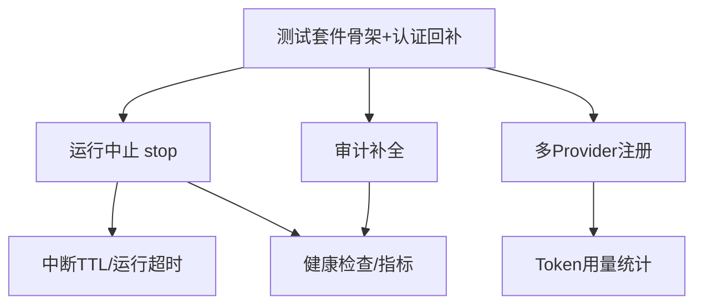

# 下一阶段开发计划（v2：可中断 · 可回归 · 可观测）

> 制定日期：2026-09-16
> 前置文档：《功能完整度分析与缺失功能清单.md》《认证与鉴权实施记录.md》
> 阶段目标：P0 清零 + P1 高性价比四项（健康检查、多 Provider、用量统计、中断治理）

---

## 一、当前基线（2026-09-16 走查结论）

| 第一梯队 P0 项 | 现状 | 证据 |
| --- | --- | --- |
| ① 认证与鉴权 | ✅ 已完成 | `interfaces/web/auth/`（三模式）、`runtime/api_key_store.py`、`runtime/device_flow_store.py`、Principal/所有权校验全量接入 |
| ② 运行中止 | ✅ 已完成（T2） | `POST /threads/{id}/stop` + `RunHandle` 注册表（T2 交付） |
| ③ 审计日志 | ✅ 已完成（T3） | 业务事件补齐 IP/UA（T3）；`hitl:approve` 独立权限；保留策略 `AUDIT_RETENTION_DAYS` + 定期清理（T3） |
| ④ 自动化测试 | ✅ 已完成（T1） | `tests/` 共 172 项全绿（T1 建骨架，T2/T3 各补回归） |

**核心判断：** 认证模块在零测试网下交付，是当前最大技术债；下一阶段要动的
`run_service.py` / `routes.py` / `event_translator.py` 恰恰是并发与流式核心路径，
测试必须先行。

---

## 二、本阶段核心目标

> 让已完成的认证体系「值得信任」，让长任务「可被打断」，
> 让运行过程「可被计量与监控」，并在此之上补齐模型层的供应商弹性。

**明确不做（防蔓延，推到第三阶段）：** MCP、RAG、技能库、文件上传/多模态、
前端 Markdown 渲染、Docker 沙箱 Tier 2、导出分享。

---

## 三、优先级排序与依据

| 顺位 | 模块 | 依据 |
| --- | --- | --- |
| 1 | 测试套件 | 所有后续改动的前置安全网；认证模块本身急需补测 |
| 2 | 运行中止 | 可用性阻塞；与运行超时/中断 TTL 同属「运行治理」，共享设计 |
| 3 | 审计补全 | 收尾认证欠账，工作量小（1 天级） |
| 4 | 健康检查/指标 | 成本极低，解锁「可部署」 |
| 5 | 多 Provider | `ModelSpec` 抽象已就位，追加注册条目即可 |
| 6 | 用量统计 | 依赖 translator 扩展，是多 Provider 的自然延伸 |
| 7 | 中断 TTL/运行超时 | 依赖 stop 稳定后再做 |

---

## 四、依赖关系

**关键设计决策：** T2 必须先引入 `RunHandle` 抽象
（`thread_id → {task, cancel_event, started_at}` 注册表），
它是 stop、运行超时、`/metrics` 运行槽位 Gauge 的共同地基，避免三处各写一套。

---

## 五、任务清单（按 Sprint 拆分，可勾选）

### Sprint 1（约 1 周）：P0 清零

#### T1 测试基础设施 + 认证回归网（2~3 天）

- [x] `pyproject.toml` 增加 dev 依赖组：`pytest`、`pytest-asyncio`、`pytest-cov`
      （`httpx` 已在主依赖中）
- [x] 新建 `tests/conftest.py`：临时 SQLite fixture、`AppConfig` fixture、
      fake 图 fixture（CI 无 API Key 也能跑）
- [x] `tests/runtime/test_api_key_store.py`：哈希/前缀/吊销/过期/时序比较路径
- [x] `tests/application/test_principal.py`：角色 → 权限矩阵全枚举
- [x] `tests/runtime/test_rate_limiter.py`：滑动窗口边界（注：限流器实际位于
      runtime 层，非 application 层）
- [x] `tests/application/test_run_service.py`：槽位互斥（`ThreadBusyError`）、
      运行中取消后槽位释放、权限/所有权语义、认领竞态复查
- [x] `tests/runtime/test_thread_store.py`：`owner_id` 过滤与认领语义
- [x] `tests/application/test_interrupt_codec.py`：approve/edit/reject/respond 编解码
- [x] 验收达成（2026-09-16）：`pytest` 91 项全绿；核心六模块行覆盖 87%
      （principal/rate_limiter 100%、interrupt_codec 98%、api_key_store 86%、
      thread_store 84%、run_service 80%）

> **T1 期间发现并修复的缺陷：**
> 1. `RunService._record_turn` 不返回登记结果，导致 `stream` 中「并发首条消息
>    认领冲突复查」为死代码——并发场景下 Bob 可静默在 Alice 的会话上运行。
>    已修复（返回记录），并为 admin 补充放行语义（与 `_ensure_ownership` 对齐），
>    以 `test_concurrent_claim_conflict_detected` 回归。
> 2. 测试配置需用「不存在的 env 文件路径」隔离本机 `.env`：pydantic-settings
>    的 `_env_file=None` 语义是「不覆盖」而非「禁用」，本机 `AUTH_MODE=oidc`
>    会静默改变测试的权限语义。

#### T2 运行中止（2~3 天）

- [x] `RunService` 内新增 `RunHandle` 注册表，替换现有裸 `set[str]`
      （`thread_id → {cancel_event, started_at}`；`run_handle` /
      `is_running` / `running_thread_ids` 一并公开，供 T4 指标与 T7 超时复用）
- [x] SSE 消费改为可被服务端取消的形式；取消检查点嵌入 `_stream_graph`
      （实现为「取下一个图分片」与「停止信号」的竞争等待——纯标志位检查在
      长工具执行期间会数十秒无响应，竞争等待让停止在下一个事件循环周期生效）
- [x] 新端点 `POST /api/threads/{thread_id}/stop`：
      所有权校验 → 触发取消 → 返回确认；幂等语义定稿为
      **200 + `{stopped, reason}`**（reason ∈ requested / already_stopping /
      not_running），409 会让「连点停止」变成报错，故弃用
- [x] 取消后以 `DONE`（payload 含 `reason: "stopped"`）收尾，前端据此复位
      输入框并显示「本轮已停止」提示（区别于 ERROR）
- [x] 前端 `app.js`：运行中「发送」旁出现「停止」按钮（`index.html` +
      `app.js` + `styles.css`，复用 `button.danger` 样式）
- [x] 审计：`run_cancelled` 事件落库（actor / target / 已运行时长；
      停止请求原子置位后审计，并发重复请求只落一次）
- [x] 补测试：`tests/application/test_run_stop.py`（8 项：幂等三分支、
      DONE(stopped) 收尾与槽位释放、已产出事件不丢失、权限/所有权、审计）
- [x] **风险验证（2026-09-17 真机）**：取消于工具执行中段时的子进程回收已实测
      （脚本：`scripts/smoke_stop_kill.py`——构造「父进程 + 孙进程」的长命令，
      复刻「同步 `execute` 跑在工作线程 + 取消等待 future」这一与 LangGraph
      同步节点等价的调度形态，取消后按命令行标记轮询进程存活）
      - **sandbox 档位（Tier 0 Job Object，实测）**：`--mode sandbox --timeout 15
        --settle 3 --ttl 40` —— 进程树**最终全部回收**，但不是「取消即终止」：
        孙进程 14.0s、父进程 13.0s 后才消失，`execute` 11.1s 返回（退出码 124），
        `task.cancel()` 只能取消「等待线程结果」的 future，无法中断已经在跑的
        同步 `execute`；真正兜底的是沙箱超时触发的 `TerminateJobObject`（整树）
      - **local 档位（实测）**：`--mode local --timeout 8 --settle 2 --ttl 20` ——
        父进程 18.8s、孙进程 16.8s 才消失，`execute` 16.3s 返回（exit 124），
        三者都贴着 20s 的自身寿命：**整棵进程树没有被杀，只是自己寿终**
        （连 cmd.exe 之外的 python 父进程都不在杀伤范围）。
        机制：走 `subprocess.run(shell=True, timeout=...)`，Windows 下超时只
        `TerminateProcess` 直接子进程 cmd.exe（`start_new_session` 仅在非
        Windows 生效）；孙进程由父进程 `Popen` 启动且未重定向 stdio，继承了
        管道写端，而 CPython 超时分支是「`kill()` + **无超时** `communicate()`」，
        于是 `execute()` 阻塞到写端关闭（最小实验：超时 4s、孙进程 `sleep 12`
        → 12.6s 才返回）。推论：**取消后 `execute()` 不返回 → 工作线程被占死**
        （LangGraph 同步节点走线程池，等于每次超时泄漏一个线程），比孤儿进程更隐蔽
      - **本脚本此前在 local 档位跑不完的原因与解法**：孙进程寿命 600s →
        `execute()` 600s 内不返回 → 「观察窗口 `timeout+30`」与「等 `execute`
        返回 `timeout+30`」两层等待全部跑满，下限约 2×(timeout+30)+settle ≈
        70~100s，降 `--timeout` 无效（仅弱相关）。已新增 `--ttl`（子进程寿命，
        默认 600，校验 `ttl ≥ timeout + settle + 10`，否则「寿终」会被误判成
        「被回收」），并在确认残留后不再等待 `execute`、必要时 `os._exit`
        跳过线程 join——否则解释器退出时 join 阻塞线程，又把脚本挂住数百秒
      - **结论**：`stop` 的「已停止」目前是**接口层确认**而非进程层确认，
        UI 复位后命令最长仍可在后台存活一个 `SANDBOX_TIMEOUT`
      - **后续处置（未做，列入风险登记簿）**：在 `RunHandle` 清理回调中显式
        终止进程树（sandbox：`TerminateJobObject`；local：自管 `Popen` +
        进程组/作业对象），让「已停止」与「进程已终止」对齐
      - **验证期间的副产物修复**：`runtime/sandbox/_winjob.py` 命令行改为
        `cmd /d /s /c "<命令>"`。原先无外层引号，被 cmd 的引号裁剪规则剥掉
        首尾引号后，`"C:\Program Files\x.exe" -c "a b"` 这类命令会被截断；
        而 `local` 档位的 `subprocess(shell=True)` 本身带外层引号，于是出现
        「local 能跑、sandbox 跑不了」的档位间语义差异——恰与该函数的
        设计意图相反（该缺陷正是构造长命令时暴露的）

#### T3 审计补全（1 天）

- [x] `contextvars` 中间件捕获客户端 IP/UA，`RunService._audit` /
      `ThreadService._audit` 审计写入时读取（消除业务事件无 IP/UA 限制）
      ——新增 `application/audit_context.py`（标准库 contextvars，应用层只读、
      接口层只写，不破坏单向依赖）与 `interfaces/web/request_context.py`
      （纯 ASGI 中间件，避免 `BaseHTTPMiddleware` 对 SSE 的缓冲副作用）；
      未绑定时（CLI/后台任务）IP/UA 落 `NULL`，UA 截断至 512 字符
- [x] `Principal` 权限拆分：新增 `hitl:approve`（member/admin 持有，viewer 无）；
      `resume` 路由与服务方法权限由 `thread:create` 改为 `hitl:approve`
      ——审批让此前被拦下的高危工具真正执行，风险量级高于「发起对话」
- [x] `audit_log` 保留策略：`AUDIT_RETENTION_DAYS` /
      `AUDIT_RETENTION_INTERVAL_SECONDS` 进 `config.py`（统一配置，不硬编码）；
      `AuditStore.purge_expired` 按 `created_at` 字符串比较删除超期记录，
      定期清理任务 `runtime/audit_retention.py` 由 `bootstrap/web.py` 装配、
      Web lifespan 启停（CLI 是一次性进程，不背常驻协程）
- [x] 补测试：`test_audit_context.py`（上下文隔离/截断/并发不串扰）、
      `test_audit_enrichment.py`（业务审计带 IP/UA、无上下文落 NULL、
      审计故障不影响业务）、`tests/interfaces/web/test_request_context.py`、
      `test_audit_store.py`（保留清理边界与参数校验）、
      `test_audit_retention.py`（周期执行、失败重试、停止回收）；
      权限矩阵与 resume 权限回归同步更新
- [x] **归档 sink（Sprint 1 收尾补做，2026-09-17）**：新增
      `runtime/audit_archive.py`，清理前把超期事件按批写成 JSONL
      （先写 `.part` 再原子改名，写完 `fsync`；空批次不留文件，失败丢弃半成品）；
      `AuditStore` 新增 `fetch_expired`（按 `id` 游标分页，避免 OFFSET 错位漏读）
      与模块级 `expiry_cutoff`，`purge_expired` 接受显式 `cutoff`
      ——**归档与删除共用同一把尺子**，否则后算的截止时间更晚会删掉
      「扫过但没归档」的夹缝记录
      - **fail-closed**：归档失败时异常上冒、本轮不删除，宁可让审计表继续增长
        并打 ERROR 日志，也不用「清理成功」的假象掩盖数据丢失
      - 配置：`AUDIT_ARCHIVE_ENABLED`（默认开）/ `AUDIT_ARCHIVE_DIR`
        （默认 `./.data/audit-archive`）/ `AUDIT_ARCHIVE_BATCH_SIZE`（默认 500），
        由 `bootstrap/web.py` 装配；关掉即退化为「只删不导出」
      - 补测试：`tests/runtime/test_audit_archive.py`（JSONL 落盘与提交、
        空批次不留文件、失败不留半成品、文件名冲突递增、多批次归档后清零、
        归档失败不删除、显式 cutoff 语义、游标分页与参数校验）

> **T3 期间发现的既有问题（已找到解法，不阻断）：** 本机 `uv run lint-imports`
> 以 GBK 解码 `.importlinter`（含中文注释）失败。**解法：执行前置
> `PYTHONUTF8=1`**（PowerShell 用 `$env:PYTHONUTF8="1"`，bash 用 `export`），
> 实测 `Analyzed 69 files — Contracts: 6 kept, 0 broken`，T3/T4 新增导入
> 全部满足六条契约（`interfaces` 不直连 `runtime`、`runtime` 为叶子层等）。
> 仍建议把该命令纳入 UTF-8 环境（CI 或已导出 `PYTHONUTF8` 的终端）执行。

**Sprint 1 验收门禁：第一梯队 P0 四项全部 ✅；实施记录文档落盘。**

---

### Sprint 2（约 1 周）：可观测 + 模型弹性

> **进度（2026-09-17）：** T4、T5 均已交付并冒烟通过，测试总数 **252 项全绿**
> （T1 基线 172 → T3 归档补 13 → T4 补 45 → T5 补 22）；分层契约
> `PYTHONUTF8=1 uv run lint-imports` 六条全 KEPT。
> **Sprint 2 验收门禁已达成**（可部署到带探活的环境、不依赖单一供应商）；
> 下一项开工 **T6 用量统计**。

> **T4/T5 联调冒烟（真机，2026-09-17）：** `/health` 200、
> `/ready` 200（database + model 均 ok）、`/metrics` 200（四计数 0、审计 3）、
> `/api/models` 200（本机仅有 DeepSeek 密钥，故只注册 `deepseek-flash`
> ——条件注册按预期生效）。

#### T4 健康检查与指标（1~2 天）

- [x] `GET /health`：进程存活（只回答「进程在不在」，不掺任何依赖判断，
      避免一次依赖抖动就让编排系统重启一个其实健康的进程）
- [x] `GET /ready`：DB 连通（`ThreadMetaStore.ping`，`SELECT 1`）+ 默认模型
      配置可解析（`ModelRegistry.probe_config` 静态自检：别名已注册、密钥非空
      且非占位值、base_url 合法；**不构造模型、不发请求**）。
      不健康统一 **503**；所有检查项跑完再汇总，运维一次拿到全部不健康项
- [x] `GET /metrics`：运行中会话数、累计运行数、HITL 挂起数、审计事件计数、
      进程运行时长。数据源为 `RunHandle` 注册表、HITL 挂起集合与
      `AuditStore.count_all()`，不引重型依赖（无 Prometheus 客户端）
      ——审计采集失败时该字段落 `null` 而非 `0`：`0` 会被读成「表里没数据」，
      `null` 才表达「这次没采到」
- [x] 补测试：`tests/application/test_health_service.py`（就绪三条路径、
      无目录时跳过模型项、四个计数、审计降级、构造校验）、
      `tests/interfaces/web/test_health_routes.py`（**DB 断开 → 503**、指标
      JSON 契约、服务未装配 → 503）、`tests/llm/test_registry_probe.py`
      （未注册/缺 Key/占位 Key/地址非法/不构造模型）、
      `tests/application/test_run_counters.py`（累计运行数与 HITL 登记的
      登记-清除-作废语义）

> **T4 落点：** `application/health.py`（`HealthService`）、
> `application/dto.py`（`CheckResult` / `ReadinessReport` / `MetricsSnapshot`）、
> `interfaces/web/health.py` + `interfaces/web/deps.py`（`require_state` 抽出复用）、
> `runtime/thread_store.py::ping`、`llm/registry.py::probe_config`。
> 运行计数与 HITL 挂起集合落在 `RunService`，与运行登记表共用一把锁，
> 保证指标采集不会读到互相矛盾的组合；删除会话时同步清理挂起登记。
> 冒烟（真机）：`/health` 200、`/ready` 200（两项均 ok）、
> `/metrics` 200 且四个计数为 0、审计计数为 3。

#### T5 多 Provider（2~3 天）

- [x] 主依赖追加 `langchain-openai>=1.6.2`、`langchain-anthropic>=1.7.2`
      （二者此前是传递依赖，显式声明后 `uv.lock` 已同步）；
      Ollama 保持可选——`langchain-ollama` 未列入依赖，用户需要时在
      `.env` 里显式设置 `OLLAMA_BASE_URL` 并自行安装该包
- [x] `build_default_registry` 改为**按配置存在性条件注册**：
      DeepSeek **恒定注册**（定稿：它既是默认模型，也保证 `specs` 非空约束
      不被触发——另一条路「放宽构造约束」会让空注册表这一非法状态合法化）；
      OpenAI / Anthropic 按密钥是否提供注册，Ollama 按是否显式设置地址注册
      - **定稿理由**：下拉框里出现一个「点了才报缺少 `OPENAI_API_KEY`」的条目，
        等于把配置错误转嫁给终端用户；不注册则它根本不出现，误用别名仍被
        `get` 的 `KeyError` 与 `/ready` 的探测拦下
      - **顺带修掉一个隐性缺陷**：`pydantic-settings` 从 `.env` 读到的密钥
        不会写回 `os.environ`，而 provider SDK 与本模块的探测/构建都按环境
        变量取值——「密钥只写在 .env」的部署会出现「配置里有 Key、运行却报
        缺少环境变量」。新增 `_ensure_env` 在环境变量缺失时把配置值回填一次
        （占位值不回填，避免制造「有密钥」的假象）
- [x] `ModelCatalog` 展示字段的 provider 标识：**已具备，无需改动**
      ——`ModelInfo` 与 `registry.describe()` 一直带有 `provider`
- [x] `.env.example` 补 OpenAI / Anthropic / Ollama 配置示例（注释态，
      并说明「填了才注册」）
- [x] 补测试：`tests/llm/test_registry_providers.py`（22 项：DeepSeek 恒定注册、
      各 provider 的条件注册与占位值不注册、默认模型回落、配置回填语义、
      缺 Key / 占位 Key / 非法地址三条快速失败路径、`with_model` 共享缓存）

**Sprint 2 验收门禁：可部署到带探活的环境，且不依赖单一供应商。**

---

### Sprint 3（约 1 周）：计量与运行治理收尾

#### T6 用量统计（2~3 天）

> **进度（2026-09-17）：** 已交付，测试总数 **316 项全绿**（T4/T5 基线 252 →
> T6 补 64）。产物：`application/usage.py`（`TokenUsage` + `UsageAccumulator`，
> 兼容 `usage_metadata` / `prompt_tokens` / `response_metadata.usage` /
> `token_usage` / Ollama `eval_count` 五种口径，累计值不重复计数、跨调用自动
> 分轮）；`runtime/usage_store.py`（`usage_log` 表，写锁串行、白名单聚合
> model/thread/day）；`application/usage_service.py` + `GET /api/usage`
> （`usage:read` 权限，member 也有，服务层再按 `owner_id` 收敛）；前端
> 助手消息尾部展示「本轮用量」，CLI 同步打印 `[用量]`。停止/出错同样上报
> 用量——token 已真实消耗。
>
> **顺带收口：** 归属判定原先在 `ThreadService` 与 `RunService` 各写一份，
> 本次抽成 `application/ownership.py`（`effective_owner_id` /
> `ensure_thread_access`），用量服务直接复用——否则「能看到谁的用量」会与
> 「能读谁的会话」悄悄走出两套语义。

- [x] `event_translator` 从消息 chunk 提取 `usage_metadata`，
      做供应商归一化（DeepSeek/OpenAI/Anthropic 字段差异），
      缺失时记 0 并打日志，不静默吞错
- [x] 新表 `usage_log`：thread_id、model、prompt/completion tokens、timestamp、
      owner_id；每轮运行结束写入（含被停止与出错的轮次）
- [x] 聚合端点 `GET /api/usage`（按用户/会话/时间窗，`days` / `group_by` /
      `thread_id`，窗口上限走 `config.usage_max_window_days`）
- [x] 前端会话页显示本轮 token 消耗

#### T7 中断 TTL 与运行超时（1~2 天）

- [ ] 基于 `RunHandle.started_at` 的运行超时强制取消（复用 T2 取消通道）
- [ ] HITL 中断挂起 TTL：超时未审批的运行标记过期、释放占位、会话可重新发起
- [ ] 后台清理协程统一在 `bootstrap` 装配；超时阈值走 `config.py`
- [ ] **local 档位进程树回收（T2 验证转入，必修）**：放弃上游 `subprocess.run`。
      实测取消后整棵树（含 python 父进程）都活到自己寿终，且 `execute()` 阻塞在
      无超时的 `communicate()` → 工作线程被占死。改为自管 `Popen` +
      Job Object/进程组，超时杀整树并关闭管道；替换后重跑
      `smoke_stop_kill.py --mode local` 应转为 PASS
- [ ] **`stop` 升级为进程层确认**：`RunHandle` 清理回调显式终止进程树，使
      「已停止」与「进程已终止」对齐（当前 UI 复位后命令最长还能活一个
      `SANDBOX_TIMEOUT`）；sandbox 侧调 `TerminateJobObject` 即可
- [ ] 补测试：TTL 过期、并发清理与用户恢复的竞争

**Sprint 3 验收门禁：单次任务成本可量化；系统内不存在永久挂起的运行。**

---

## 六、风险登记簿

| 风险 | 等级 | 对策 |
| --- | --- | --- |
| stop 与检查点一致性：取消时机不当留下半写状态，resume 后消息错乱 | 高 | T2 先写取消于 token 流中段/工具执行中段的针对性测试；协作式取消（等待当前超步收尾）优先于硬 cancel |
| 沙箱子进程残留窗口：取消未即时波及 Job Object 内进程 | 中 | 已实测闭环（Tier 0 最终无残留，靠沙箱超时兜底）；根治方案是在 RunHandle 清理回调中显式终止进程树。local 档位需改为自管 Popen + 进程组，否则孙进程成孤儿 |
| 测试与真实 DB/模型耦合：CI 无 API Key | 中 | 模型层用 fake `BaseChatModel`；SQLite 用临时文件 |
| 多 Provider kwargs 兼容：`init_chat_model` 对 timeout/max_retries 支持不一 | 中 | 延续 `_read_effective_base_url` 式自检思路；加每 provider 冒烟脚本 |
| usage_metadata 字段差异 | 中 | translator 层统一归一化；缺失记 0 + 日志 |
| Windows 开发环境 asyncio 子进程行为差异 | 低 | 测试平台标记 `pytest.mark.skipif`；后续 CI 跑 Linux 双轨 |

---

## 七、迭代节奏与纪律

- **节奏**：3 Sprint × 1 周；每个 Sprint 结束产出《实施记录》文档
  （延续 `认证与鉴权实施记录.md` 惯例）+ 冒烟脚本通过 + 下 Sprint 计划校准
- **合并纪律**：T1 完成前不合并 T2 任何改动——顺序不可倒置
- **文档同步**：每完成一项，更新本文档勾选状态；
  阶段结束时更新《功能完整度分析与缺失功能清单.md》的能力盘点表
