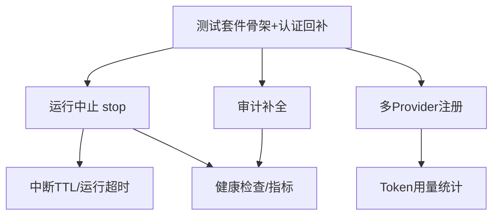

# 下一阶段开发计划（v2：可中断 · 可回归 · 可观测）

> 制定日期：2026-09-16
> 前置文档：《功能完整度分析与缺失功能清单.md》《认证与鉴权实施记录.md》
> 阶段目标：P0 清零 + P1 高性价比四项（健康检查、多 Provider、用量统计、中断治理）

---

## 一、当前基线（2026-09-16 走查结论）

| 第一梯队 P0 项 | 现状 | 证据 |
| --- | --- | --- |
| ① 认证与鉴权 | ✅ 已完成 | `interfaces/web/auth/`（三模式）、`runtime/api_key_store.py`、`runtime/device_flow_store.py`、Principal/所有权校验全量接入 |
| ② 运行中止 | ❌ 未动 | `interfaces/web/routes.py` 仅有 `/runs` 与 `/resume`；`RunService` 只有 per-thread 槽位互斥 |
| ③ 审计日志 | ⚠️ 半成品 | 认证事件已落库；业务事件（thread_run/hitl/thread_delete）缺 IP/UA；未拆 `hitl:approve` 权限；无保留策略 |
| ④ 自动化测试 | ❌ 未动 | 全仓 0 个测试文件，仅 `scripts/` 下 1 个 smoke 脚本 |

**核心判断：** 认证模块在零测试网下交付，是当前最大技术债；下一阶段要动的
`run_service.py` / `routes.py` / `event_translator.py` 恰恰是并发与流式核心路径，
测试必须先行。

---

## 二、本阶段核心目标

> 让已完成的认证体系「值得信任」，让长任务「可被打断」，
> 让运行过程「可被计量与监控」，并在此之上补齐模型层的供应商弹性。

**明确不做（防蔓延，推到第三阶段）：** MCP、RAG、技能库、文件上传/多模态、
前端 Markdown 渲染、Docker 沙箱 Tier 2、导出分享。

---

## 三、优先级排序与依据

| 顺位 | 模块 | 依据 |
| --- | --- | --- |
| 1 | 测试套件 | 所有后续改动的前置安全网；认证模块本身急需补测 |
| 2 | 运行中止 | 可用性阻塞；与运行超时/中断 TTL 同属「运行治理」，共享设计 |
| 3 | 审计补全 | 收尾认证欠账，工作量小（1 天级） |
| 4 | 健康检查/指标 | 成本极低，解锁「可部署」 |
| 5 | 多 Provider | `ModelSpec` 抽象已就位，追加注册条目即可 |
| 6 | 用量统计 | 依赖 translator 扩展，是多 Provider 的自然延伸 |
| 7 | 中断 TTL/运行超时 | 依赖 stop 稳定后再做 |

---

## 四、依赖关系

**关键设计决策：** T2 必须先引入 `RunHandle` 抽象
（`thread_id → {task, cancel_event, started_at}` 注册表），
它是 stop、运行超时、`/metrics` 运行槽位 Gauge 的共同地基，避免三处各写一套。

---

## 五、任务清单（按 Sprint 拆分，可勾选）

### Sprint 1（约 1 周）：P0 清零

#### T1 测试基础设施 + 认证回归网（2~3 天）

- [x] `pyproject.toml` 增加 dev 依赖组：`pytest`、`pytest-asyncio`、`pytest-cov`
      （`httpx` 已在主依赖中）
- [x] 新建 `tests/conftest.py`：临时 SQLite fixture、`AppConfig` fixture、
      fake 图 fixture（CI 无 API Key 也能跑）
- [x] `tests/runtime/test_api_key_store.py`：哈希/前缀/吊销/过期/时序比较路径
- [x] `tests/application/test_principal.py`：角色 → 权限矩阵全枚举
- [x] `tests/runtime/test_rate_limiter.py`：滑动窗口边界（注：限流器实际位于
      runtime 层，非 application 层）
- [x] `tests/application/test_run_service.py`：槽位互斥（`ThreadBusyError`）、
      运行中取消后槽位释放、权限/所有权语义、认领竞态复查
- [x] `tests/runtime/test_thread_store.py`：`owner_id` 过滤与认领语义
- [x] `tests/application/test_interrupt_codec.py`：approve/edit/reject/respond 编解码
- [x] 验收达成（2026-09-16）：`pytest` 91 项全绿；核心六模块行覆盖 87%
      （principal/rate_limiter 100%、interrupt_codec 98%、api_key_store 86%、
      thread_store 84%、run_service 80%）

> **T1 期间发现并修复的缺陷：**
> 1. `RunService._record_turn` 不返回登记结果，导致 `stream` 中「并发首条消息
>    认领冲突复查」为死代码——并发场景下 Bob 可静默在 Alice 的会话上运行。
>    已修复（返回记录），并为 admin 补充放行语义（与 `_ensure_ownership` 对齐），
>    以 `test_concurrent_claim_conflict_detected` 回归。
> 2. 测试配置需用「不存在的 env 文件路径」隔离本机 `.env`：pydantic-settings
>    的 `_env_file=None` 语义是「不覆盖」而非「禁用」，本机 `AUTH_MODE=oidc`
>    会静默改变测试的权限语义。

#### T2 运行中止（2~3 天）

- [x] `RunService` 内新增 `RunHandle` 注册表，替换现有裸 `set[str]`
      （`thread_id → {cancel_event, started_at}`；`run_handle` /
      `is_running` / `running_thread_ids` 一并公开，供 T4 指标与 T7 超时复用）
- [x] SSE 消费改为可被服务端取消的形式；取消检查点嵌入 `_stream_graph`
      （实现为「取下一个图分片」与「停止信号」的竞争等待——纯标志位检查在
      长工具执行期间会数十秒无响应，竞争等待让停止在下一个事件循环周期生效）
- [x] 新端点 `POST /api/threads/{thread_id}/stop`：
      所有权校验 → 触发取消 → 返回确认；幂等语义定稿为
      **200 + `{stopped, reason}`**（reason ∈ requested / already_stopping /
      not_running），409 会让「连点停止」变成报错，故弃用
- [x] 取消后以 `DONE`（payload 含 `reason: "stopped"`）收尾，前端据此复位
      输入框并显示「本轮已停止」提示（区别于 ERROR）
- [x] 前端 `app.js`：运行中「发送」旁出现「停止」按钮（`index.html` +
      `app.js` + `styles.css`，复用 `button.danger` 样式）
- [x] 审计：`run_cancelled` 事件落库（actor / target / 已运行时长；
      停止请求原子置位后审计，并发重复请求只落一次）
- [x] 补测试：`tests/application/test_run_stop.py`（8 项：幂等三分支、
      DONE(stopped) 收尾与槽位释放、已产出事件不丢失、权限/所有权、审计）
- [ ] **风险验证（待真机）**：取消于工具执行中段时，Tier 0 Job Object
      子进程是否被终止——需在 EXECUTION_MODE=local 下实测 `execute` 场景；
      代码侧已确保取消传播到 `graph.astream`（触发各节点的取消清理路径），
      真机验证后补录结论

#### T3 审计补全（1 天）

- [ ] `contextvars` 中间件捕获客户端 IP/UA，`RunService._audit` /
      `ThreadService` 审计写入时读取（消除业务事件无 IP/UA 限制）
- [ ] `Principal` 权限拆分：新增 `hitl:approve`；
      `resume` 路由权限由 `thread:create` 改为 `hitl:approve`
- [ ] `audit_log` 保留策略：`AUDIT_RETENTION_DAYS` 进 `config.py`（统一配置，不硬编码），
      定期归档清理任务在 `bootstrap` 装配

**Sprint 1 验收门禁：第一梯队 P0 四项全部 ✅；实施记录文档落盘。**

---

### Sprint 2（约 1 周）：可观测 + 模型弹性

#### T4 健康检查与指标（1~2 天）

- [ ] `GET /health`：进程存活
- [ ] `GET /ready`：DB 连通 + 默认模型配置可解析（轻量探测，不真正发请求）
- [ ] `GET /metrics`：运行中会话数、累计运行数、HITL 挂起数、审计事件计数
      ——数据源为 `RunHandle` 注册表与 `AuditStore` 计数器，不引重型依赖
- [ ] 补测试：ready 探测的降级路径（DB 断开 → 503）

#### T5 多 Provider（2~3 天）

- [ ] dev/主依赖追加 `langchain-openai`、`langchain-anthropic`（Ollama 可选）
- [ ] `build_default_registry`（`llm/registry.py:225-257`）改为
      **按环境变量存在性条件注册**；处理 `specs` 非空约束
      （DeepSeek 恒定注册或放宽 `ModelRegistry` 构造约束，二选一定稿）
- [ ] `ModelCatalog` 展示字段增加 provider 标识
- [ ] `.env.example` 补各 provider 配置示例
- [ ] 补测试：各 spec 的 Key 缺失快速失败路径、`with_model` 视图共享缓存

**Sprint 2 验收门禁：可部署到带探活的环境，且不依赖单一供应商。**

---

### Sprint 3（约 1 周）：计量与运行治理收尾

#### T6 用量统计（2~3 天）

- [ ] `event_translator` 从消息 chunk 提取 `usage_metadata`，
      做供应商归一化（DeepSeek/OpenAI/Anthropic 字段差异），
      缺失时记 0 并打日志，不静默吞错
- [ ] 新表 `usage_log`：thread_id、model、prompt/completion tokens、timestamp；
      每轮运行结束写入
- [ ] 聚合端点 `GET /api/usage`（按用户/会话/时间窗）
- [ ] 前端会话页显示本轮 token 消耗

#### T7 中断 TTL 与运行超时（1~2 天）

- [ ] 基于 `RunHandle.started_at` 的运行超时强制取消（复用 T2 取消通道）
- [ ] HITL 中断挂起 TTL：超时未审批的运行标记过期、释放占位、会话可重新发起
- [ ] 后台清理协程统一在 `bootstrap` 装配；超时阈值走 `config.py`
- [ ] 补测试：TTL 过期、并发清理与用户恢复的竞争

**Sprint 3 验收门禁：单次任务成本可量化；系统内不存在永久挂起的运行。**

---

## 六、风险登记簿

| 风险 | 等级 | 对策 |
| --- | --- | --- |
| stop 与检查点一致性：取消时机不当留下半写状态，resume 后消息错乱 | 高 | T2 先写取消于 token 流中段/工具执行中段的针对性测试；协作式取消（等待当前超步收尾）优先于硬 cancel |
| 沙箱子进程泄漏：取消未波及 Job Object 内进程 | 高 | 实测 Tier 0/1；泄漏则在 RunHandle 清理回调中显式终止 Job 对象 |
| 测试与真实 DB/模型耦合：CI 无 API Key | 中 | 模型层用 fake `BaseChatModel`；SQLite 用临时文件 |
| 多 Provider kwargs 兼容：`init_chat_model` 对 timeout/max_retries 支持不一 | 中 | 延续 `_read_effective_base_url` 式自检思路；加每 provider 冒烟脚本 |
| usage_metadata 字段差异 | 中 | translator 层统一归一化；缺失记 0 + 日志 |
| Windows 开发环境 asyncio 子进程行为差异 | 低 | 测试平台标记 `pytest.mark.skipif`；后续 CI 跑 Linux 双轨 |

---

## 七、迭代节奏与纪律

- **节奏**：3 Sprint × 1 周；每个 Sprint 结束产出《实施记录》文档
  （延续 `认证与鉴权实施记录.md` 惯例）+ 冒烟脚本通过 + 下 Sprint 计划校准
- **合并纪律**：T1 完成前不合并 T2 任何改动——顺序不可倒置
- **文档同步**：每完成一项，更新本文档勾选状态；
  阶段结束时更新《功能完整度分析与缺失功能清单.md》的能力盘点表
